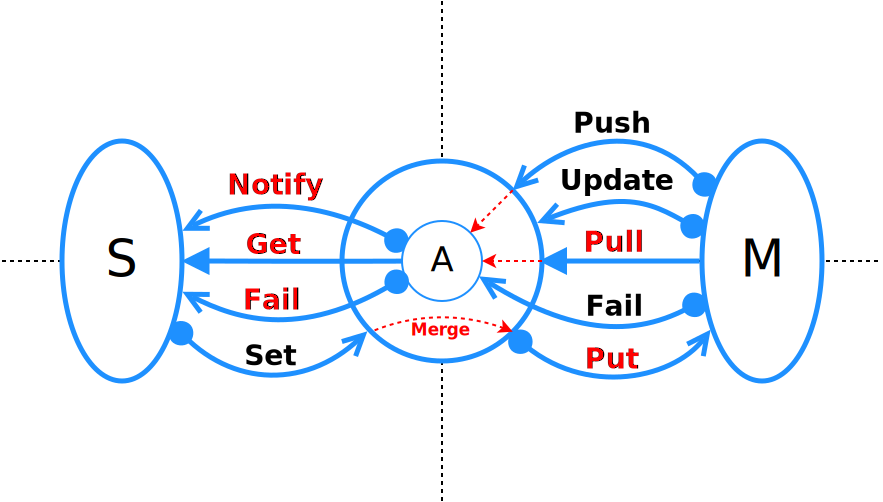

class: center, middle, inverse

# ReactiveDI

---

# Зачем

* Хочу DI и [SOLID][wiki.SOLID] на фронтенде
* Хочу простой код только с бизнес-логикой и очевидными связями на типах, без декораторного мусора и стримов
* Хочу убрать зависимость от [mobx][mobx], [cellx][cellx], [derivable][derivable], [redux][redux]
* Хочу зависимость от React и ему подобных превратить в зависимость от JSX и h-интерфейса (React.createElement)
* А зависимость от less/sass/stylus превратить в зависимость от интерфейса jss-стиля, но не самого [jss][jss]
* А еще поддержку flow и typescript для компонент и стилей, а не только классов и функций
* Хочу стандарт для интеграции модулей, как например [ng-modules][angular2-modules] и это не просто import
* Хочу на любом уровне вложенности сказать, что для всех дочерних зависимостей, AbstractUserModel теперь - это CheckoutUserModel
* Хочу абстракцию от того как, получены данные - через конфиг, rest api или еще как-то

---

# Мощность

Кто дает больше вариантов написать хороший код?

.chart-bar[

|                | Java. Spring | PHP. Symfony2 | ReactiveDI | Inversify | Angular2 | Redux | Angular1 | React | VanilaJS |
|-------------------------------------------------------------------------------------------------------------------------|
| .skyblue[Mark] | 10           | 9             | 9          | 8         | 7        | 6     | 5        | 3     | 1        |
]

Бизнес-код vs мелкая фигня

---
class: center, middle, inverse

# Существующие решения
---

# Вброс 1. [Inversify][inversify]

* Завязан на метаданные typescript о классе
* Слабая работа с [областями видимости][inversify.scope]: как делать локальные контейнеры на компонент?
* Не абстрагирует от реакта
* Не абстрагирует от реактивности, подходы mobx, redux и пр. просачиваются в код

---

# Вброс 2. [Angular2 Di][angular2.di]

* Framework lock in
* Прибит к anular2
* Толстый, много util-кода
* Не работает с реактивностью
* Angular3, что-то не так?

---

# Вброс 3. [Mobx][mobx]

* Framework lock in
* Прибивается к приложению, нельзя без рефакторинга заменить на аналог
* Навязчивость: много декораторов, actions, transactions просачиваются в код
* Не [pull][habr.atoms.frp]-архитектура: не управляет загрузкой данных, как, например [cellx][cellx] или [mol][mol]

---

# Вброс 4/1. [Redux][redux]

* Идея абстракции вызова функции обновления стейта через экшен и диспетчер, аналогична идее DI - абстракции через интерфейс, только не ООП
* Навязчивость подхода: обновляй стейт только через action creators, action, reducers, middlewares, stores и деструкцию объектов.
* Много шаблонного кода
* Не избавляет от setState
* [Сложные middlewares][redux.mdl] из-за асинхронности. От последовательности их применения зависит результат
* Взятый у [elm][elm] [ФП-стиль][redux.apply.mdl] в js: куча анонимных arrow без типизации, createCreateCreateSome-функции
* Убогий паттерн-матчинг на switch/case в reducers
* Атомарность изменений на уровне state, а не свойства, необходимость shallowEqual
* Не проработанность стандартов: огромное кол-во плагинов и middlewares, делающих одно и тоже, но разными способами.

---

# Вброс 4/2. Redux

```js
type TodoAction = {type: 'addTodo'; text: string;}
type Todo = {id: string; text: string; completed: bool;}
type TodosState = Todo[]
function todosReducer(state: TodosState, action: TodoAction) {
  switch (action.type) {
    case 'addTodo':
      return [
        {
          id: state.reduce((maxId, todo) =>
            Math.max(todo.id, maxId), -1) + 1,
          completed: false,
          text: action.text
        },
        ...state
      ]
    }
  }
}
// ...
dispatch(({
  type: 'addTodo',
  text: 'Use Redux'
}: TodoAction))
```
---

# Вброс 4/3. DI

```js

type Todo = {id: string; text: string; completed: bool;}
class Todos extends Array<Todo> {}

class TodoService {
  todos: Todo[]
  constructor(todos: Todos) {
    this.todos = todos
  }

  addTodo(text: string) {
    this.todos.push({
      id: state.reduce((maxId, todo) =>
        Math.max(todo.id, maxId), -1) + 1,
      completed: false,
      text
    })
  }
}
// ...
todoService.addTodo(text)
```

---

# Вброс 5. [React][react]

* Framework lock in
* Не single responsibility: и рендерит, и состоянием управляет, хуки не отделимы от компонента
* Монолит - vdom нельзя заменить на свой
* В jsx React.createElement - синглтон, из-за этого костыль [react-context][react-context]
* Навязчивость: конструктор класса React.Component занят под props, context
* Нет стандарта по загрузке данных - костыли на componentDidMount
* Недо-DI на [react-context][react-context]
* Прибитость к PropTypes вместо typescript/flow
* Экосистема часто прибивается к реакту: react-router (роутинг тут не должен иметь отношения к react)
* Программирование не-верстки на JSX ([container components][smart.dumb])
* Много legacy (200 кб) и не всех устраивающая скорость рендеринга

---

# Вброс 6. React-подобные

* [preact][preact] - мелкий react, базовый класс
* [inferno][inferno] - быстрый react, базовый класс
* [choo][choo] - легковесный, прибит к template-strings шаблонам
* [deku][deku] - jsx-based, прибит к redux
* [rionite][rionite], базовый класс, прибит к template-strings
* [cycle][cycle] - хипстота и ФП головного мозга
* [vue][vue] - монолит, framework lock-in
* [matreshka][matreshka] - монолит, не SOLID, framework lock-in

---

# Общие болячки экосистемы JS

* Синглтоны, увеличивающие [зацепление][couple]
* [STUPID][STUPID] вместо [SOLID][wiki.SOLID]
* Подходы, делающими приложения зависимыми от библиотек, а не интерфейсов
* Навязчивость подходов: react, redux
* Framework Lock-in

Все это делает приложения в прямой зависимости от этих библиотек. Однажды выбрав React, придется поддерживать до конца.

Эти болячки свойственны взрослеющим экосистемам, где сложность еще не достигла определенного порога: PHP в свое время был таким же (CodeIgniter, Kohana).
---
class: center, middle
# Для чего был нужен Virtual DOM?

---
class: center, middle

# Какими должны быть компоненты, стили и данные?
---
class: center, middle

# Правильно ли делить на Smart и Dumb?

[Они же][smart.dumb] Fat и Skinny, Smart и Dumb, Stateful и Pure, Screens и Components, Presentational и Container, Hiorder и Pure.
---

class: center, middle

# Нужны ли less, sass, stylus, cssmodules?
---

class: center, middle

# Ехал redux через redux...
---
# Virtual DOM (1/1)

Давайте представим html в виде композиции функций. Корневая функция - это страница, аргументы функции - свойства всех html-тегов.

```js
function Page(setName: (e: Event) => void, name: string) {
  return <Header>
    <input type="name" onChange={setName} value={name} />
  </Header>
}
```
---

# Virtual DOM (1/2)

Давайте представим html в виде композиции функций. Корневая функция - это страница, аргументы функции - свойства всех html-тегов.

```js
function Page(setName: (e: Event) => void, name: string) {
  return <Header>
    <input type="name" onChange={setName} value={name} />
  </Header>
}
```

Что-то медленно рендерится в браузере, давайте навернем кэш с diff/patch над DOM и назовем это virtual-dom

---

# Virtual DOM (1/3)

Что-то опять медленно, а давай добавим в компоненты, сделав их классами, метод shouldComponentUpdate.

```js
class Page extends React.Component {
  shouldComponentUpdate(nextProps) {
    // ...
  }

  render() {
    const {setName, name} = this.props
    return <Header>
      <input type="name" onChange={setName} value={name} />
    </Header>
  }
}
```

Переложим задачу оптимизации на ручной труд программистов.

А заодно подсадим их на React, т.к. компонент теперь гвозями прибит к React.

---

# Virtual DOM (1/4)

* Что-то дохрена свойств в корневом компоненте, а давайте часть логики размажем по компонентам и добавив setState. Ну и что, что эта логика прибита к компоненту - назовем это statefull component
* Что-то свойств все-равно дохрена. А давайте корневому виджету сетить значение-объект, которое неявно прокинется всем дочерним, эдакий ServiceLocator. Ну и что, что react-only и антипаттерн, назовем это [react-context][react-context].

### Итог

* Идея virtual DOM не работает: все-равно медленно, а что бы было быстро, нужно ручками оптимизировать через shouldComponentUpdate
* Логика вокруг setState не переопределяема без создания лишних props

---

# А что если использовать observable-обертки?

Ведь отсечение лишних рендеров должно происходить раньше, в самих данных.

Например, [mobx][mobx], [cellx][cellx] - подобные обертки дают возможность отказаться от тяжелого virtual DOM.

Примеры компонент без virtual DOM: [choo][choo], [deku][deku], [rionite][rionite]

---
# Будущее за ООРП


* [Jin-atom][jin.atom] первая ООРП-библиотека на js, не в виде отдельного модуля), 2013 г.
* [Cellx][cellx] отдельная библиотека, 2015 г.
* [Derivable][derivable], удобное апи, калька с [closure atoms][closure.atoms], 2015 г.
* [Mol][mol], продолжение jin-atom, не в виде отдельного модуля, 2016 г.
* [Mobx][Mobx] (бывший mobservable) первая распиаренная ООРП-библиотека на магии get/set, не pull-архитектура, 2016 г.

---

# Pull-архитектура

* Компонент не должен знать каким образом получены данные
* Данные загружаются по факту запроса этих данных компонентом

Например в [cellx][cellx] это реализовано так:

```js
  import cellx from 'cellx'

  const a = cellx((push, fail, oldValue) => {
    fetch('/some')
      .then(push)
      .catch(fail)

    return oldValue | 1
  })

  a.get() === 1 // Во тут выполнится pull
  a.isPending(),  a.getError()// статус и ошибки выполнения
```

---

# Pull в reactive-di. Модель

```js
// UserModel.js
import {hooks, source} from 'reactive-di/annotations'
import {Updater, UpdaterStatus} from 'reactive-di'

@source()
export default class UserModel {
  name: string
  email: string
}
```

---

# Pull в reactive-di. Статус

```js
// User.js
import {hooks} from 'reactive-di/annotations'
import {Updater, UpdaterStatus} from 'reactive-di'
import UserModel from './UserModel'

export class UserStatus extends UpdaterStatus {}

class UserModelHooks {
  _updater: Updater

  constructor(updater: Updater) {
    this._updater = updater
  }
  onMount() {
    this._updater.update(fetch('/user'), UserModel, UserStatus)
  }
}

export default hooks(UserModelHooks)(UserModel)
```

---

# Pull в reactive-di. Компонент:

```js
import {UserModel, UserStatus} from './User'

function User(
  props: {},
  {user, status}: {user: UserModel, status: UserStatus}
) {
  return <div>{user}, loading status and errors: {status}</div>
}
```

---

## Пример локализации

```typescript
@source({key: 'ButtonLang'})
export default class ButtonLang {
    text: string

    static defaults = {
        text: 'OK'
    }

    constructor(rec: Object) {
      Object.assign(this, ButtonLang.defaults, rec)
    }
}
```

---
class: center, middle, inverse

# Переиспользование vs refactoring или dumb и smart

---
# Переиспользование vs refactoring


* Как сохранить связанность, уменьшая зацепление.
* Или как делать модули простыми, решающими одну небольшую задачу, но знающие минимум об остальных модулях.
* props - путь к сильному зацеплению.
* redux-connect, mobx-connect, redux-reselect - путь к непереиспользуемому коду

---

# Dumb-компоненты

*Переиспользуемые компоненты*

* Давайте компоненты без зависимостей от сторонних либ, без состояния, назовем pure, кастомизация их только через свойства
* А если всякую мелочь надо хранить, например сообщение об ошибке ввода в инпут? Ок, с состоянием, но совсем чуть-чуть, назовем их Dumb, Presentational
* Пример: Page, User, List

---

# Smart-компоненты

*Где теперь стейт и бизнес-логика будет?*

* Давайте часть компонент сделаем без generic html-верстки
* Они могут содержать Dumb и другие Smart
* Прибьем гвоздями к flux, redux, mobx, relay, flux, etc, сделав не переиспользуемыми, а назовем Statefull или Container или Hiorder или Smart
* Пример: CheckoutPage, CheckoutUser, PaymentList

---

# Smart vs Dumb

#### Все делать dumb

* 100% переиспользуемость
* ад интеграции, т.к. часть логики работает через props
* ад рефакторинга из-за растущего числа props от низа к корневому компоненту

#### Все делать smart

* 0% переиспользуемость
* легко интегрировать и рефакторить

---


# Как делить на Smart и Dumb?

* Нельзя заранее сказать, что будет smart, а что dumb.
* Smart *CheckoutUser* вдруг понадобился в другом проекте, копипастить?

---

# А что если переиспользовать иначе?

* Все компоненты получать через DI, который инжектит в него все зависимости
* Добавить в Di механизм регистрации зависимостей, когда интерфейс сопоставляется с реализацией
* Саму регистрацию не прибивать к компонентам, а делать в отдельном месте - [composition root][comp.root]
* Добавить возможность это [composition root][comp.root] делать и рядом с компонентами тоже, обеспечив переопределение зависимостей на любом уровне вложенности

Аналогично работает Angular2. Осталось адаптировать к реакт-подобным.

---

# Компонет с зависимостями

```js
// @jsx h
import {UserService, CurrentUser} from './srv'

interface UserProps {
  id: string;
  name: string;
}
interface UserState {
  userService: UserService;
  currentUser: CurrentUser;
}


function User(props: UserProps, state: UserState, h: any) {
  return <div>{props} / {state}</div>
}
```

* Построен с учетом принципов инверсии контроля
* Совместим с flowtype и typescript
* Framework-независимый, зависит только от интерфейса функции h

---

# Использование без DI

```tsx
import React from 'react'
import User from './User'
import type {UserState, UserProps} from './User'
interface UserState {
  userService: UserService;
  currentUser: CurrentUser;
}

class UserImpl extends React.Component<UserProps, UserState> {
  state: UserState = {
    userService: new UserService(),
    currentUser: new User()
  }
  render() {
    return User(this.props, this.state, React.createElement)
  }
}
```
User - не зависит от react

---

# Научить DI

Автоматизировать создание UserImpl. babel рулит.

```js
// @jsx h
import {UserService, CurrentUser} from './srv'
interface UserProps {
  id: string;
  name: string;
}
interface UserState {
  userService: UserService;
  currentUser: CurrentUser;
}

function User(props: UserProps, deps: UserState, h: Function) {
  return h('div', `${props} / ${state}`)
}

Reflect.defineMetadata("design:subtype", "jsx", User);
Reflect.defineMetadata("design:paramtypes", [{
  userService: UserService,
  currentUser: CurrentUser
}], User);
```

---
# Универсальный компонент

Универсальный компонент, адаптируемый не только к react.

```js
import {UserService, CurrentUser} from './srv'

interface UserProps {
  id: string;
  name: string;
}
interface UserState {
  userService: UserService;
  currentUser: CurrentUser;
}


function User(props: UserProps, deps: UserState) {
  return <div>{props} / {state}</div>
}
```

Похоже на substack [hyperx][hyperx], только интегрируемо с DI и поддерживается в flow.

---

# Lifecycle hooks

Как в [inferno][inferno], [deku][deku], [cycle][cycle] и не которых других - хуки отдельно от компонента:

```js
// UserWithHooks.js
import {hooks} from 'reactive-di/annotations'
import User from './User'
class UserHooks {
  onMount($: HTMLElement) {
    // something
  }

  onUnmount() {
    // something
  }
}

export default hooks(UserHooks)(User)
```

---

class: center, middle, inverse

# Less, sass, stylus, cssmodules vs js

---

# Задача

А как зеленую кнопку сделать красной для юзера Васи, без переопределения стилей и пересборки компонента и без использования свойства style?

Что бы имена стилей при написании компонента, поддерживались бы в flow/typescript.

---
# Решение

Стили опишем в классах js, т.к. иначе не добиться мощности ООП:

* композицию, наследуемость
* управляемость через состояние в runtime
* поддержку имен классов в flow и typescript
* переопределяемость через DI


* Внешний вид сделаем, как у css, назовем это [cssx][cssx]
* Полная аналогия html и jsx. Тут Facebook сказал А, но не сказал Б
* Осталась реализация - [jss][jss], [typestype][typestype]
* И интеграция ее в DI, что б стили автоматически монтировались в DOM
---

# Пример стилей

```typescript
// @flow
import {theme} from 'reactive-di/annotations'
import UIVars from './UIVars'

@theme
export default class ButtonTheme {
    base: string

    __css: mixed
    constructor({color}: UIVars) {
        this.__css = {
            base: {
                backgroundColor: color
            }
        }
    }
}
```

---

# Использование в компоненте

```js
// @flow
import ButtonTheme from './ButtonTheme'

export default function Button(
    {text}: {text: string},
    {theme}: {theme: ButtonTheme}
) {
    return <button className={theme.base}>{text}</button>
}
```

---

# Что дает ReactiveDI

* Не один di-контейнер на приложение, можно делать области видимости под каждый компонент
* Возможность переопределить в точке входа или в декораторе компонента любую зависимость или компонент
* Все есть класс или фабрика - уникальный id
* Все зависимости описываются в терминах typescript или flow через конструкторы классов или функций-фабрик
* Напрямую, через импорты, используются только util-хелперы
* Компоненты должны содержать только верстку и поддерживаться в flowtype/typescript IDE
* Реактивность не фигурирует в коде, стейт обновляет специальный сервис

---

# Переопределение реализаций

```typescript
import {abstract} from 'reactive-di/annotations'
import type {Currency} from 'qiwi-ui-ng'

@abstract
export default class AbstractValues {
    providerName: string
    description: string
    amount: ?Currency
}
```

В js и typescript нельзя получить interface как reflection-значение в runtime. Используем "абстрактные" классы.

Точка входа в приложение, [Composition Root][comp.root]:

```typescript
export const rdi: RegisterDepItem[] = [
    [AbstractValues, OrderInfoValues]
]
```

---

# Контейнер для компонента

```js

import BaseService from 'some/BaseService'
import AbstractValues from 'some/AbstractValues'
import UserValues from './UserValues'

function User(props: {}, {service}: {service: BaseService}) {
  // ...
}

export default component({
  register: [
    BaseService,
    [AbstractValues, UserValues]
  ]
})(User)
```

* service - на каждый User свой
* service использует UserValues, но знает только об AbstractValues

---
class: center, middle, inverse
# Организация структуры
---

# Микроприложения

Пусть есть форма ввода адреса Address. Все, что имеет отношение к Address, должно быть рядом, в одной директории (группировка по доменам):

```bash
address
  assets - картинки и шрифты
  AddressView[Layout, Form].js - компонент
  AddressTheme.js - стили
  AddressLang.js - модель с локализациями
  AddressValues.js - модель с данными формы
  AddressErrors.js - модель с ошибками формы
  AddressSchema.js - json-схема для проверки AddressValues
  AddressValidator.js - сервис для проверки введенных данных
  AddressService.js - сервис для обновления и проверки модели
```

---

# Иерархия

* Приложение состоит из множества доменов, например loginForm, address, passport, personal, identificationForm
* Строгая иерархия: если passport используется только в identificationForm, то он находится в папке identificationForm/passport, не выше
* Домены не ссылаются друг на друга. Если в разных доменах общий код, он выделяется в директорию common
* Директория common находится на одном уровне с доменами, которые на нее ссылаются
---

# Пример иерахии

```yml
identification:
    common:
        IdentificationFormOptions.js
    identificationConfirm:
    identificationForm:
        common:
            SomeValues.js
        passport:
            PassportView.js
        IdentificationFormView.js
```

---

## Пример компонента

```typescript
export interface ButtonProps {
    id: string;
    className?: ?string;
    onClick: () => void;
    children?: ?mixed;
    disabled? :?boolean;
}
interface ButtonState {
    theme: ButtonTheme;
    helper: EventHelper;
    lang: ButtonLang;
}
export default function Button(
    {id, className, onClick, disabled, children}: ButtonProps,
    {theme, helper, lang}: ButtonState
) {
    return <button
        id={id}
        disabled={disabled}
        className={className || theme.button}
        onClick={helper.click(onClick)}
    >{lang.text || children}</button>
}
```

---

## Пример хуков

```typescript
import {hooks} from 'reactive-di/annotations'
import Button from './Button'
import SomeDep from './SomeDep'

@hooks(Button)
export default class ButtonHooks {
  constructor(some: SomeDep) {}
  onMount($: HTMLElement) {}
  onUnmount($: HTMLElement) {}
}
```
---
class: center, middle
# Конец первой части

[couple]: https://ru.wikipedia.org/wiki/%D0%97%D0%B0%D1%86%D0%B5%D0%BF%D0%BB%D0%B5%D0%BD%D0%B8%D0%B5_(%D0%BF%D1%80%D0%BE%D0%B3%D1%80%D0%B0%D0%BC%D0%BC%D0%B8%D1%80%D0%BE%D0%B2%D0%B0%D0%BD%D0%B8%D0%B5)
[stupid]: http://williamdurand.fr/2013/07/30/from-stupid-to-solid-code
[wiki.SOLID]: https://ru.wikipedia.org/wiki/SOLID_(объектно-ориентированное_программирование)
[symfony2]: https://symfony.com/
[di]: https://ru.wikipedia.org/wiki/%D0%92%D0%BD%D0%B5%D0%B4%D1%80%D0%B5%D0%BD%D0%B8%D0%B5_%D0%B7%D0%B0%D0%B2%D0%B8%D1%81%D0%B8%D0%BC%D0%BE%D1%81%D1%82%D0%B8
[inversify]: https://inversify.io
[inversify.scope]: https://github.com/inversify/InversifyJS/blob/master/wiki/scope.md
[ninject]: https://www.ninject.org
[angular2.di]: https://angular.io/docs/ts/latest/guide/dependency-injection.html
[angular2-modules]: https://angular.io/docs/ts/latest/guide/ngmodule.html
[habr.atoms.frp]: https://habrahabr.ru/post/235121
[flow]: http://flowtype.org
[react-context]: https://facebook.github.io/react/docs/context.html
[preact]: https://preactjs.com
[inferno]: https://github.com/trueadm/inferno
[hyperx]: https://github.com/substack/hyperx

[rxjs]: https://github.com/Reactive-Extensions/RxJS
[mol]: https://github.com/eigenmethod/mol
[jin.atom]: https://github.com/nin-jin/pms-jin
[derivable]: https://ds300.github.io/derivablejs
[cellx]: https://github.com/Riim/cellx
[mobx]: https://mobxjs.github.io/mobx
[closure.atoms]: http://clojure.org/reference/atoms

[react]: https://facebook.github.io/react
[choo]: https://github.com/yoshuawuyts/choo#how-does-choo-compare-to-x
[rionite]: https://github.com/Riim/Rionite
[deku]: https://github.com/anthonyshort/deku
[mithril]: http://mithril.js.org
[cycle]: https://cycle.js.org/

[redux]: http://redux.js.org
[redux.mdl]: http://redux.js.org/docs/advanced/Middleware.html
[redux.apply.mdl]: https://github.com/reactjs/redux/blob/master/src/applyMiddleware.js
[redux-thunk]: https://github.com/gaearon/redux-thunk
[reselect]: https://github.com/reactjs/reselect
[elm]: https://guide.elm-lang.org/

[vue]: https://vuejs.org/
[matreshka]: https://ru.matreshka.io/

[no-effect-standart]: https://twitter.com/dan_abramov/status/689639582120415232
[smart.dumb]: https://medium.com/@dan_abramov/smart-and-dumb-components-7ca2f9a7c7d0#.xlt8kcxk8
[comp.root]: http://sergeyteplyakov.blogspot.ru/2013/01/blog-post.html
[cssx]: https://github.com/krasimir/cssx
[jss]: https://github.com/cssinjs/jss
[cssx.flow]: https://github.com/facebook/flow/issues/1940
[typestype]: https://github.com/typestyle/typestyle
