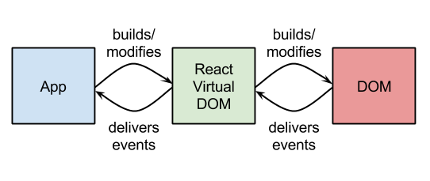

## Как прекратить войну фреймворков

Note: Меня зовут Сергей. Я работаю фронтенд-разработчиком в компании QIWI. У нас много проектов, в которых используется react, redux, mobx. В данный момент я, вместе с небольшой командой, работаем над проектом, где кроме react используется reactive-di. Это самописная библиотека для управления состоянием, построенная на принципах инверсии зависимостей. Мой доклад будет не столько про нее, сколько про причины, приведшие к написанию reactive-di. И вот они...

---

### Убийцы архитектуры


Note: У Petka Antonov, создателя bluebird промисов, есть статья "Убийцы оптимизации" (Optimization killers). Где говорится каких конструкций в коде следует избегать, что бы код не стал менее производительным. Аналогично, я попробую рассказать об "убийцах архитектуры", т.к. коде, который затрудняет поддержку программ, интеграцию модулей, ведет к появлению багов в run time, а не в compile time и решении их.

---

### А что не так?


Note: Если не брать в расчет хайп, то как узнать, хороший или плохой фреймворк или библиотека, которую вы собираетесь использовать. Кто делал smart компонент, а потом переписывал на smart+dumb? Кто огребал с невозможностью переиспользовать или переопределить логику внутри компонента? Кто пробовал фетчить данные в componentDidMount и сталкивался с тем, что разные компоненты запрашивают одни и те же данные. Кто сталкивался с проблемами оптимизации и вколачивал в компоненты shouldComponentUpdate, а потом ловил с них баги. Как показать статус загрузки состояния (крутилку), да не всего целиком, а конкретного стора или модели. Немного про архитектуру...

---


Note: Общая тенденция в програмостоении такова - одну большую проблему разбиваем на много маленьких. Как-то так, причем кучи еще разноцветные. Большинство js-фреймворков - это обычно одно ядро, вокруг которого накручено много всего: react занимается и ui и состояние там есть и логика вокруг него. Однако, если посмотреть, как развивались другие языки, например, java, php, то там тоже были подобные решения, однако в итоге все придит к множеству мелких библиотек не связанных между собой или связанных через интерфейсы. Библиотеки легко собираются в фреймворк посредством некого клея: dependency injection. Даже говорят мета-фреймворк или (BUILD YOUR OWN) BYO.

---

### Слои


Note: Это слои - данные, представления, логика. Вместо C может быть что угодно. Деление такое не с проста. Если мы меняем view слой, то это затронет только его, если логику, то изменятся и представление, если структуру данных - это затронет все слои. Иными словами: что чаще меняем, то делаем менее связаным с остальными частями.

---

### Связи


Note: Я упомянул связи. Они бывают сильные: когда extends React.Component или React.createElement замаскированный под jsx. Так и слабые: интерфейсы на props, использование React.context вместо import. Для масштабирования и поддержки большого приложения важны как раз слабые связи. Однако сильные связи упрощают навигацию по проекту и отладку в отсутствии мощных IDE и др. инструментов разработчика.

---

#### Кирпичи


Note: Есть еще базовые кирпичи - это функции, которые мы рассовываем по слоям и связываем между собой. Сами функции бывают с контекстом или чистые. Классы можно свести к функциям, контекст которых это this. Рассмотрим компоненты - частный случай для UI слоя. К примеру, все, кто программировал на реакте, знают, что компоненты бывают чистые и с состоянием. Поведение первых зависит только от свойств, вторые от свойств и еще от состояния.

---

### Чистый компонент

- _dumb, presentational_
- view = component(props)
- Легкость переиспользуемости <!-- .element: class="fragment" data-fragment-index="2" -->
- Рефакторинг: O(depth * props) <!-- .element: class="fragment" data-fragment-index="3" -->

Note: Для чего нужен компонент, результат которого - функция от свойств (иными словами шаблон, template). Основное преимущество в том, что все  или большинство ручек управления публичны, мы можем менять его поведение как угодно через них - т.е. компонент легко переиспользовать. Есть обротная сторона - сложно рефакторить приложение, по-большей части состоящее из таких компонент.

---

### Чистый компонент

```js
function CounterView({count}) {
  return <div>
      Count: {count}
  </div>
}
```

Note: Первый киллер. Реализация чистого компонета React. Вроде никаких связей с другими частями приложения.

---

### На самом деле нет

```js
function CounterView({count}) {
  return React.createElement('div', null, 'Count: ', count)
}
```

Note: Но если собрать с babel-preset-react то появится прямая зависимость от React, если использовать другие решения с jsx: deku, inferno, vue, то суть таже. Нельзя переиспользовать чистый компонент в другом фреймворке, поддерживающим JSX. Поэтому мы имеем кучу реализаций несчастного bootstrap с material на разных фреймворках именно из-за этой сильной связи, кроме желания выпендриться, изобретая 15й стандарт. Кроме JSX нужны стандарты на то, во что он компилируется.

---

### По-настоящему чистый

```js
function CounterView({count}, h: CreateElement) {
  return h('div', null, 'Count: ', count)
}
```

Note: Например, ослабить связь можно, например добавив в конец аргумент, реализующий интефейс createElement. Такой компонент можно где угодно переиспользовать, задав соотвествующий h. Я уже говорил о сложности рефакторинга O(depth * props), из-за него в большом приложении не бывает только чистых компонент.

---

### Компоненты с состоянием

- _smart, hiorder, container_
- view = component(props, *state*)
- State - труднее переиспользовать <!-- .element: class="fragment" data-fragment-index="2" -->
- Легче рефакторить - O((depth * props) + state) <!-- .element: class="fragment" data-fragment-index="3" -->

Note: Есть еще компоненты с состоянием. Из-за state компонент кастомизировать сложнее, т.к. вся логика вокруг state - это приватные детали его реализации и расширять их мы больше не можем. Заранее не всегда можно сказать, потребуется ли менять или расширять их. Но с этим мирятся, т.к. приложение, где много компонент с состоянием легче рефакторить, публичных свойств меньше - часть сложности перетекает в state.

---

```js

class CounterView extends React.Component<{name: string}> {
  state = {count: 1}
  constructor(props: Props) { super(props) }

  render() {
    return <div>
      {this.props.name}: {this.state.count}
      <button onClick={

        () => this.setState(({count}) => {
          count: count + 1
        })

      }>Add</button>
    </div>
  }
}
```

Note: И вот еще один архитектурный убийца - это React-реализация такого компонента. Ограничений тут гораздо больше, чем сильная связь на React.createElement. Некоторые из них: React.Component - прямая завязка на реакт, без которой, к нему гвоздями прибитые flow и typescript не помогут выявить ошибки в props. Конструктор подчиняется неким негласным соглашением, что первый аргумент только props. setState - привязка к способу реакта менять состояние. Такой компонент нельзя использовать где-то вне реакта. Ключевой момент, тут нарушен принцип изоляции слоев - в UI присутствует и логика и верстка и состояние и нет способа изолировать одно от другого, без наворотов над ними, вроде react templates. Создали большую сложность, а потом решают архитектурные и проблемы оптимизации через усложнение приложения.

---

### Статические импорты

```js
import counterService from './counterService'

class CounterView extends React.Component {

// ...
          count: counterService.add(this.state.count)
// ...
}
```

Note: Мы прям в компоненте писали count + 1, а что если надо вынести логику изменения состояния. Можно все фигачить на синглтонах и импортах. Осюда еще один киллер - связь с counterService жесткая, реализацию нельзя поменять на что-то с таким же интерфейсом. Выделили компонент в стороннюю библиотеку, заиспользовали в 10 проектах, а в 11м потребовалось дополнить метод add логикой валидации. Тут жесткая связь начинает нам это мешать делать, приходится рефакторить, добавлять публичное свойство. Ключевой момент - масштабирование идет не через расширение, а через рефакторинг.

---

```js
class CounterView extends React.Component {
  // ...
  static contextTypes = {
    counterService: PropTypes.object
  }

  // ...
      count: this.context.counterService.add(this.state.count)
  // ...
}
```

Note: С этим можно бороться через React.context, правда он страшный, фейсбуковцы сами его стыдятся, поэтому не сильно документируют. Понятно почему, такая реализация внедрения зависимостей (dependency injection), черевата увлекательным отловом багов на продакшене, вместо скучных подсказок typescript или flow на этапе написания кода. PropTypes - это эмуляция типизации, лохматое легаси со времен отсутствия flow и принятия ts. Вообще это не очень хороший признак, если ошибки, связанные с типами приходится отлавливать в run time.

---

```js
class CounterModel {
  count: number = 0
}

function CounterView(
  { name }: { name: string },
  { counter }: { counter: CounterModel },
  h
) {
  return <div>
    {name}: {count.counter}
    <button onClick={
      () => counter.count = counter.counter + 1
    }>Add</button>
  </div>
}
```

Note: Можно придумать компонент с более четкими границами слоев. Совместимый с flow и nuclide ide. 1й аргумент - props, 2й - контекст, 3й - createElement. Пример полностью абстрагирован от ui-фреймворков, от state-management фреймворков. Cреда исполнения компонента обеспечивает связь CounterModel и CounterView, реактивность counter.counter + 1 и адаптацию к react, mobx, angular, да чему угодно, только адаптеры нужно написать.

---


Note: Я тут все про реакт, да про реакт, а что с другими... Vue, aurelia, glimmer, deku, yo-yo, cyclejs, funnel... Вы поняли да? Стоит пожалуй только angular2 упомянуть, т.к. среди всего это камин аута со слоями, связями и типизацией, трюкам со стримами, только он чуть приподнялся на ступеньку.

---


Note: Точнее так... О чем это я.

---

```js
@Component({
  selector: 'my-counter',
  templateUrl: './counter.component.html'
})
class CounterView {
  counterService: CounterService
  counter: number = 0
  @Input name: string

  constructor(counterService: CounterService) {
    this.counterService = counterService
  }

  addCounter() {
    this.counter = this.counterService.add(this.counter)
  }
}
```

Note: Ребята из команды angular2, не стыдятся контекста, а гордо его показывают в конструкторе. Вау, пропсов в нем нет. Они декоратором @Input помечены. В итоге это гораздо ближе к нативному синтаксису typescript. Правда без типов это все не очень удобно использовать.

---

```js
// ...
class CounterView {
  // ...
}
CounterView._deps = [CounterService]
```

Note: Что бы магия заработала, ангуларовцы слегка прогнув микрософт с их тайпскриптом, записывают ссылку на CounterService в функцию Counter. Такая наколеночная страшненькая рефлексия, привнесенная в typescript. А среда исполнения, т.е. dependency injection ангулара, по этой ссылке подсовывает готовый объект.

---


```js
@Component({
  selector: 'my-counter',
  templateUrl: './counter.component.html'
})
class CounterView {
  counterService: CounterService
  counter: number = 0
  @Input name: string

  addCounter() {
    this.counter = this.counter + 1
  }
}
```

Note: Однако и тут есть ложка дегдя и не одна, например CounterView - это реактивная модель со свойством counter и сервис c addCounter, прибито это все через декоратор @Component к шаблону counter.component.html. Один к одному сцепили шаблон, описание контракта к этому шаблону, модель, и логику по работе с ней. Поимев проблемы с выведением типов в html-шаблоне, если JSX flow понимает, то тут только за счет сторонних решений, плагинов к IDE и т.д, которые заведомо в этой области будут хуже работать, чем typescript, т.к. он специализированный инструмент.

---

### redux+

- time travel
- Transaction log
- CRDT

Note: redux хорошее решение, когда вам нужно time travel, логирование, распределенность.

---

### redux-

- Шаблонный код
- Сложнее менять состояние
- Центральное состояние
- Простая база, но бесполезная без сложного окружения
- Middleware + async

Note: Но redux это не про то, как уменьшить кол-во шаблонного кода, не про то, как проще поменять состояние, не про то, как разделить состояние на много кусочков т.к. основная идея - это центральный стейт. Это все можно конечно сделать, но путем дополнительных усложнений, в виде redux-thunk, saga, мидлвар, часто не очень понятных в цепочке. Кто пробовал раскрутить пример цепочки мидлвар из официальной документации redux, тот поймет.

---

```js
// ...
// single state - less modularity
function mapStateToProps(state: {user: UserState}) {
  return { name:  state.user.name } // state.user undefined
}
const AppContainer = connect(mapStateToProps)(CounterView)

// reducer is not type checked
const reducer = combineReducers({ xyz: user })
const store = createStore(reducer)

// store in Provider is not type checked
// How to pass something else
// Not here
<Provider store={null /* store */}>
  <CounterContainer title="123" />
</Provider>
// flow check: Found 0 errors
```

Note: Рассмотрим react-redux (как и в mobx-react). Во первых, несмотря на интерфейс, state в mapStateToProps приходит от всего приложения, т.е. центральное состояние нарушает модульность приложения. Во вторых, нет сопоставления типов состояния и редьюсеров в combineReducers. state.user undefined, т.к.  в combineReducers я ошибся и написал xyz вместо user, а в mapStateToProps state.user будет undefined и flowtype не отловит это. В третьих, никак не проверяется интерфейс того, что мы подали в Provider. В четвертых, в контекст через провайдер нельзя передать сервис, только стор. В пятых, задача контекста, которую решает Provider, не имеет отношения ни к react, ни к ui, она относится к способу связывания слоев в приложении, к внедрению зависимостей.

---

```js
declare class Provider<S, A> extends React$Component<
  void,
  { store: Store<S, A>, children?: any },
  void
> { }
```

Note: Однако Provider, прибит к React$Component

---

```js
<Router history={history}>
  <Route path="/" component={App}>
    <Route path="foo" component={Foo}/>
    <Route path="bar" component={Bar}/>
  </Route>
</Router>
```

Note: Таких примеров много, ReactRouter, ReactSideEffect, ReactHelmet - это все реализация контроллеров в слое с шаблонами.

---

```js

class RouterState {
  path: string
}

function CaseComponent(
  {routerState}: {
    routerState: RouterState
  }
) {
  switch (routerState.path) {
    case '/': return App
    case 'foo': return Foo
    default: return App
  }
}
```

Note: А ведь достаточно просто развязать это все через состояние. Строка браузера влияет на состояние, например mobx, а дальше делается CaseComponent, который уже выбирает нужный. И не надо прибивать роутинг к реакту, а потом делать убыстренный клон реакта inferno, и копипастиь его туда, как с inferno-router.

---

Прибитость React:

```js
this.setState({counter: 123})
```

Избыточность Redux:

```js
dispatch({type: 'INCREMENT', val: 123})
```

Компонент Angular2:

```js
this.heroes = heroes
```

Модели Mobx:

```js
store.counter = 123
```

Note: Каждый предлагает свой способ менять состояние. setState - прибит к реакту, что бы изменить состояние в редукс, компонент должен знать об интерфейсе dispatch и об экшене, либо придется писать дополнительный код для адаптации к redux-thunk. Такой подход череват шаблонным кодом, особенно если использовать типизацию и сложность внедрения этой самой типизации. В ангуларе состояние изменить проще, но вся эта магия работает почему-то только в компоненте. mobx предоставляет самый простой интерфейс по чтению/записи состояния. Ключевой момент, последний способ он не предполагает завязанности на какую-либо библиотеку.

---

Оптимизация

### 5 > 3


Note: Про оптимизацию слишком много хайпа, в основном, все современные тенденции во фронтенде это про то, кто больше попугаев покажет в ui-bench: fiber, vdom, prepack, inferno. Оптимизация нужна из-за отставания браузеров от бизнес задач и медленной скорости их развития из-за легаси из которого состоит web. Так проще конкурировать, цифрами убедить проще, т.к. меньше надо знать. React 3 попугая выдает, Inferno 5, значит Inferno лучше. Конкурировать, доказывая архитектурные преимущества, гораздо сложнее.

---

Оптимизации в приложении



Note: С появлением react было много хайпа о том, что VDOM, лежащий в его основе, настолько быстрый, что делает оптизизацию в приложении не нужной. Однако, добавив кэш (VDOM) перед выводом в браузер, получили проблему инвалидации кэша, которая требует некоторых вычислений.

---

### React

```js
class CounterView extends React.Component {
  state = {count: 0}

  shouldComponentUpdate(nextProps, nextState) {
    return nextState.count === this.state.count
  }

  _add = () => {
    this.state.count++
    this.forceUpdate() // Oh shi
  }

  render() {
    return <div>{this.props.name}: {this.state.count}
      <button onClick={this._add}>Add</button>
    </div>
  }
}
```

Note: Упрощают вычисления через shouldComponentUpdate, который позволяет делать тонкую оптимизацию, точнее неявно создавать баги и смешивать бизнес код с инфрастуктурным кодом, не имеющим отношения к иходной задаче. Костыль этот существует потому, что react начали проектировать с конца, с view слоя, а не со слоя данных, Если было бы иначе, решений, подобных VDOM с shouldComponentUpdate, не было бы на свете вовсе. А пока, код, отвечающий за оптимизацию в вашем приложении, помогает вам скоротать немало часов, отлавливая баги на продакшене. А вы нашли тут багу, не? Вот flow не нашел.

---

### Angular

```js
@Component({
  template: '{{counter}}',
  changeDetection: ChangeDetectionStrategy.OnPush
})
class CounterView {
  counter = 0
  constructor(private cd: ChangeDetectorRef) {}

  ngOnInit() {
    this.counter = this.counter + 1; // application state changed
    this.cd.markForCheck(),
  }
}
```

Note: Думаете в angular2 лучше? По-умолчанию, ангулар считает, что любое свойство в компоненте - Observable и оборачивает его, так что присвоение this.counter, вызывает ререндеринг. Это видимо тормозной на больших приложениях механизм, который правильнее было бы не делать в ангуларе вовсе, а вынести в стороннее решение, вроде mobx. Тут changeDetection.OnPush такой же костыль как и shouldComponentUpdate.

---


Note: Это я к тому, что оптимизация в коде приложения не нормальное явление, как нам пытаются преподнести из многочисленных маркетинговых докладов. Это признание несостоятельности идеи или реализации фреймворка касательно автоматической оптимизиации. Идея определяет резервы оптимизации, а хорошие алгоритмы только помогут полнее их реализовать, как в Inferno.

---

### Mobx

```js
const CounterView = observer(({count}) => <div>{count}</div>)
const NameView = observer(({name}) => <div>{name}</div>)

const AppView = observer(store => <div>
  <CounterView count={store.count}/>
  <NameView name={store.name}/>
</div>)

class Store {
  @observable count: number = 0
  @observable name: string = 'test'
}

<AppView store={new Store()} />
```

Note: Но, резервов оптимизации гораздо больше в mobx-подобных решениях (derivable, cellx, mol). Оптимизация происходит раньше, в слое данных, а не в VDOM (react) или в компонентах (angular). В подобных решения VDOM не нужен. Однако все-равно остается вопрос, какие компоненты делать observer-ами? Это что-то вроде дилемы, куда пихать shouldComponentUpdate, а куда нет. Как я говорил ранее, в хорошем фреймворке ее быть не должно, должна решать автоматизация. Допустим, автоматизация решила, что все компоненты - обсерверы, то тогда возникают лишние ререндеры, т.к. обращение в компоненте к store.count означает подписывание на изменения в этом свойстве. Т.к. обращение происходит и в AppView и в CounterView, то при изменении count, будут переренедрены они оба, хотя достаточно только CounterView. Это обратная сторона ненавязчивости mobx-стримов, в том, что unboxing, разворачивание стримов происходит там, где не надо и здесь еще много работы.

---

### Монолитные анализаторы

- Прибить jsx к flow
- Прибить React.Component к flow <!-- .element: class="fragment" data-fragment-index="1" -->
- Прибить angular2 templates к typescript <!-- .element: class="fragment" data-fragment-index="2" -->

Note: Ребята из фейсбука придумали jsx и flow, который понимает этот самый jsx, относительно компонент с состоянием - flow просто прибит гвоздями к реакту. Там в коде есть прямая зависимость анализатора от extends React.Component. А что делать ребятам из deku, vue? Переизобретать свой flow, как они это сделали с redux (vuex)? А typescript еще более монолитный - это не только анализатор, а еще компилятор, для которого до недавнего времени нельзя было даже свой transformation-plugin написать. Например поддержка шаблонов angular2 в ts просто прибита гвоздями по аналогии с jsx, компилятор знает о фреймворке.

---

### Переизобретение и копипаст

- redux/vuex
- {React, Vue, Inferno, Redux, Mobx}-router
- inferno-{redux, mobx}

Note: Следствия плохо спроектированной базы: связей и слоев, которое, в свою очередь, следствие хилого наследия javascript: типов долго небыло, сильная фрагментация надстроек над js.

---


Путь тернист и конца пока не видно

Note: Как прекратить войну фреймворков. Я пытаюсь озвучить критерии для тех, кто хочет объективно оценивать фреймворки, а не вестись на хайп. Экспериментаторам, которые пытаются писать свои, привнося что-то новое.

---

### Что стоит пытаться делать?

- Каркас для связей data - ui - business logic, DI
- Экосистема: типы, поддержка в ide: JSX<!-- .element: class="fragment" data-fragment-index="0" -->
- Безопасное модульное состояние (mobx)<!-- .element: class="fragment" data-fragment-index="1" -->
- Иерархическая интеграция: ng-modules <!-- .element: class="fragment" data-fragment-index="2" -->
- Оптимизацию задвинуть за сцену<!-- .element: class="fragment" data-fragment-index="3" -->
- Упростить рефакторинг O(depth * props + state) <!-- .element: class="fragment" data-fragment-index="4" -->
- Баласировать между KISS и di-окружением<!-- .element: class="fragment" data-fragment-index="5" -->

Note:  1. DI - это ключ. Фреймворк должен быть изолированным набором библиотек, связанных через инверсию зависимостей, каждая библиотека со своей маленькой ответственностью (никаких state и context в ui). 2. Проектируя фреймворк, думать в первую очередь о типах и безопасности на всех уровнях MVC. 3. Должна быть настоящая модульность, центральное состояние, как в redux, не годится. 4. Фреймворк должен помогать строить приложение из иерархически выстроеных мини-приложений, которые интегрируются в общую шину, ng-modules хороший пример, аналогов которому я не нашел в мире react. 5. Оптимизация в слое фреймворка, а не приложения. 6. Стремиться делать фреймворк таким, что бы упрощался рефакторинг. 7. Оставаться простым и искать компромис между хилыми возможностями js/babel/flow/typescript платформ и быть дружественным к DI.

---

### reactive-di


Note: Цель доклада не была рассказать о reactive-di. Я просто несколько штрихов наброшу

---

### Model

```js
class Counter {
    count: number = 0
}
```

Note: Вот, например, как выглядит модель. Начальное состяние и контракт в одном флаконе. При таком подходе не может быть undefined-багов, не нужно дополнительных сериализаторов/десереализаторов. На основе моделей также делаются локализации, реактивные стили через jss. Не содержит декораторов или любых других зависимостей от фреймворка.

---

### View

```js
function CounterView(
    // public:
    {name}: { name: string; },

    // private:
    {counter, actions}: {
      counter: Counter;
      actions: CounterActions;
    }
) {
    return <div>
      {name} {counter.count}
      <button onClick={actions.add}>Add</button>
    </div>
}
```

Note: Чистая верстка, с контрактом и разделением на публичный интрефейс (props) и приватный (context)

---

### Action

```js
@actions class CounterActions {
  _counter: Counter

  constructor(counter: Counter) {
    this._counter = counter
  }

  add() {
    src(this._counter).set({
      count: this._counter.count++
    })
  }
}
```

Note: Сервис, которые предоставляют компоненту методы, по сути экшены, меняющие состояние: тут может быть валидация, запрос на сервер и т.д. В отличие от традиционного DI, зависимость может быть от модели данных (в ангуларе это ValueProvider), только это value реактивно. При выполнении метода add, CounterActions переинициализируется с новым значением, т.е. reactive-di это стримы, упрятаные внутрь di.

---

### Lifecycle

```js
@hooks(Counter)
class CounterHooks {
  pull(counter: Counter): Observable<Counter> {

    let count = counter.count

    return new Observable((observer: Observer<Count>) => {
      setTimeout(() => observer.next(++count), 1000)
    })
  }
}
```

Note: Часто бывает так, компонент отрендерился и вам нужно актуализировать его состояние. Тут помогают механизмы, которые есть в некоторых ORM на других языках (Doctrine, Hibernate). Логика актуализации состояния Counter задается в таком сервисе. Когда первый раз отрендерится хотя бы один компонент, использующий Counter, выполнится метод pull и Observable c этого момента будет управлять Counter ом. В mobx аналогично сделан хелпер where, в cellx и mol есть похожие механизмы.

---


- React - стримы в компоненте (View)
- Mobx - ненавязчивые стримы в приложении (Model)
- Reactive-di - все MVC внутри стримов (Relations)

---

- [github.com/zerkalica/reactive-di](https://github.com/zerkalica/reactive-di)
