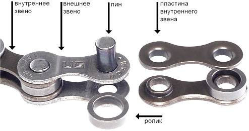
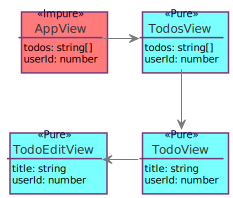

## Как прекратить войну фреймворков

Note: Меня зовут Сергей. Я работаю фронтенд-разработчиком в компании QIWI. В QIWI много проектов на react, redux, mobx. Но есть один, в котором используется reactive-di. Эта библиотека для управления состоянием - моя попытка ответить на вопрос "Как прекратить войну фреймворков". Зачем же понадобилось изобретать еще одну библиотеку?

---

### WTF

- Dumb, smart?
- view + state coupling <!-- .element: class="fragment" -->
- setState, redux, mobx, rxjs? <!-- .element: class="fragment" -->
- material или bootstrap для каждого <!-- .element: class="fragment" -->
- vendor lock in <!-- .element: class="fragment" -->

Note: Что это за война такая? Например, мы делаем smart компонент на redux, а потом выясняется что его нужно переиспользовать в другом проекте с mobx. Если про JSX можно сказать, что это более-менее универсальный стандарт для нескольких фреймворков: inferno, vue с адаптером для jsx, deku. Потому что в разных фреймворках по-разному меняется состояние и этот механизм тесно связан с версткой. Нет слоя, абстрагирующего нас от redux или mobx, setState. Мы не можем сделать один универсальный полноценный material или bootstrap набор компонент. Мы получаем vendor lock in. Берем мы angular, react, vue или что-то еще, мы сильно привязываем код приложения к этим фреймворкам. Затруднен обмен решениями между фреймворками.

---

### Убийцы архитектуры


Note: Причины этого в некоторых недочетах проектирования фреймворках, я их назвал "убийцах архитектуры". Т.е. подходах, которые усложняют взаимозаменяемость частей программы. Решение проблемы лежит в хорошей архитектуре.

---

### Эра монолитнго ядра

- Component = view + data + logic <!-- .element: class="fragment" -->
- Поверх - redux, mobx <!-- .element: class="fragment" -->
- Не поверх, а вместо <!-- .element: class="fragment" -->

Note: Сейчас большинство js-фреймворков - это обычно одно ядро, вокруг которого накручено много всего. Например, react занимается и подготовкой представления и состояние там есть, и логика вокруг него накручена. redux, mobx сторятся поверх этого ядра и управляют через него, это решения следствия, а не проблемы.

---

### От ядру к слоям

- Легкий каркас, библиотека, интеграция <!-- .element: class="fragment" -->
- Метафреймвоки <!-- .element: class="fragment" -->
- Микросервисы, микроядерность <!-- .element: class="fragment" -->
- PHP - Symfony, silex <!-- .element: class="fragment" -->
- Java - Spring <!-- .element: class="fragment" -->
- JS - Angular2 <!-- .element: class="fragment" -->

Note: Если посмотреть, как развивались другие языки, например, java, php, то видно, что от монолитности постепенно переходят к концепции, когда фремворк - это очень легкий каркас для связи множества мелких библиотек через интерфейсы. Есть сторонняя библиотека, к ней пишется слой интеграции в фреймворк и дальше она используется как его часть. Даже говорят мета-фреймворк. Например: В PHP есть symfony, а есть его облегченная версия - silex, на тех же библиотеках, в Java аналогично с Spring. У нас, на фронтенде, наиболее близок к этой концепции - angular2, за исключением того, что сторонние библиотеки переизобретены командой angular2.

---


Note: Общая тенденция в програмостоении такова - одну большую проблему разбиваем на много маленьких. Как-то так, причем кучи еще разноцветные.

---

### Слои


Note: Все части проложения можно разделить по слоям - данные, представления, логика. Что чаще меняем, то делаем менее связаным с остальными частями. Могут быть разные вариации это подхода (FLUX например), но данные, логика и представления обычно разделяются.

---


```js
class Some extends React.Component {
  render() {
    // ...
  }
}

```

Note: Я упомянул связи - стрелки. Они бывают сильные: когда extends React.Component или React.createElement замаскированный под jsx. Говорят, что код жесткий. Этот тип связей упрощает навигацию по проекту и отладку в отсутствии мощных IDE и др. инструментов разработчика, т.к. очевидно, что это за реализация. Можно посмотреть реализацию, по импортам попрыгать.

---



```js
interface IUser {
  name: string;
}

function MyComponent(props: { user: IUser }) {
  return <div>{user.name}</div>
}
```

Note: Так и слабые: интерфейсы на props. Когда не очивдно, что за реализация IUser, она где то в другом месте задается. Для масштабирования и поддержки большого приложения важны как раз слабые связи. Проблема в том, что для работы с ними важны мощные инструменты разработки, IDE, flow, typescript. Иначе усложняется навигация и рефакторинг такого кода. Поэтому переход к слабой связанности - это вопрос взросления экосистемы и усложнения задач.  В JAVA, PHP переход был уже много лет назад, а у нас, во фронтенде, только начинает что-то появляться в виде ангулар2.

---

### Функции

- f(x) <!-- .element: class="fragment" -->
- f(context)(x) <!-- .element: class="fragment" -->
- new F(context).method(x) <!-- .element: class="fragment" -->

Note: Есть еще базовые кирпичи - это функции, которые мы рассовываем по слоям и связываем между собой. Сами функции бывают как чистые, так и с некоторым контекстом. Классы - это набор функций с контекстом в виде this.

---

### Компоненты


Note: Применительно к компонентам. Все, кто программировал на реакте, знают, что компоненты бывают pure и statefull. Поведение первых зависит только от свойств, вторые от свойств и еще от контекста, под контекстом подразумевается и состояние и React.context, разница между ними только в реактивности.

---

### Чистый компонент

- Он же dumb, presentational <!-- .element: class="fragment" -->
- view = component(props) <!-- .element: class="fragment" -->
- Легкость переиспользуемости <!-- .element: class="fragment" -->
- Рефакторинг: O(depth * props) <!-- .element: class="fragment" -->

Note: Чистый компонент, он же dumb, presentational - функция от свойств (иными словами шаблон, template). Основное преимущество в том, что все  или большинство ручек управления публичны, мы можем менять его поведение как угодно через них - т.е. компонент легко переиспользовать. Есть обротная сторона - сложно рефакторить приложение, по-большей части состоящее из таких компонент.

---



Note: Представим, что состояние есть только в корневом компоненте страницы, а все остальное - из чистых компонент, вот свойство userId в TodoEditView стало не нужным, в результате нам надо удалить его из всей цепочки. т.к. оно просто транзитом прокидывается вниз от AppView. Из-за сложности рефакторинга O(depth * props), в реальном приложении не бывает только чистых компонент, это и отличает фронтенд от бэкенда, иначе это был бы просто шаблонизатор.

---

### Чистый компонент

```js
function CounterView({count}) {
  return <div>
      Count: {count}
  </div>
}
```

Note: Вот как он реализован в JSX. Вроде никаких связей с другими частями приложения.

---

### На самом деле нет

```js
function CounterView({count}) {
  return React.createElement('div', null, 'Count: ', count)
}
```

- vendor lock in <!-- .element: class="fragment" -->
- Переиспользование в реакт <!-- .element: class="fragment" -->

Note: Но если собрать с babel-preset-react то появится прямая зависимость от React. Нельзя переиспользовать чистый компонент в другом фреймворке, поддерживающим JSX. Однако, можно продолжить мысль и переиспользовать в рамках языка и среды, т.е. уменьшить долю каркаса, постоянной части до минимально возможной.

---

### По-настоящему чистый

```js
function CounterView({count}, h: CreateElement) {
  return h('div', null, 'Count: ', count)
}
```

- Ослабить связь <!-- .element: class="fragment" -->
- createElement как аргумент <!-- .element: class="fragment" -->
- babel plugin для автоматизации <!-- .element: class="fragment" -->

Note: Для этого надо ослабить связь с createElement, например, добавив в конец аргумент, реализующий интефейс createElement. Такой компонент можно где угодно переиспользовать, задав соотвествующий h. Конечно усложняется написание компонента, надо добавлять аргумент, но это легко автоматизируется через babel плагин.

---

### Компонент с состоянием

- Он же smart, hiorder, container <!-- .element: class="fragment" -->
- view = component(props)(state) <!-- .element: class="fragment" -->
- State - труднее переиспользовать <!-- .element: class="fragment" -->
- Легче рефакторить - O((depth * subProps) + state) <!-- .element: class="fragment" -->
- props = subProps + state <!-- .element: class="fragment" -->

Note: Компонент с состянием кастомизировать сложнее, т.к. вся логика вокруг state - это приватные детали его реализации и расширять их мы больше не можем. Заранее не всегда можно сказать, потребуется ли менять или расширять их. Но с этим мирятся, т.к. приложение, где много компонент с состоянием легче рефакторить, публичных свойств меньше - часть их перетекает в state.

---

```js
class CounterView
  extends React.Component<void, {name: string}, {count: number}> {

  state = {count: 1}
  constructor(props: Props) { super(props) }

  render() {
    const increment = () => this.setState(({count}) => {
      count: count + 1
    })

    return <div>
      {this.props.name}: {this.state.count}
      <button onClick={increment}>Add</button>
    </div>
  }
}
```

Note: А вот React-реализация такого компонента. Некоторые из ограничений такой реализации.

---

```js
class CounterView
  extends React.Component<void, {name: string}, {count: number}> {

  state = {count: 1}

  constructor(props: Props) { super(props) }
```

- Сильно связан с React.Component <!-- .element: class="fragment" -->
- flowtype связан с React <!-- .element: class="fragment" -->
- Конструктор занят под props <!-- .element: class="fragment" -->
- Маскироваться под react <!-- .element: class="fragment" -->

Note: React.Component - прямая завязка на реакт, без которой, к нему гвоздями прибитые flow и typescript не помогут выявить ошибки в props. Конструктор подчиняется неким негласным соглашением, что первый аргумент только props.

---

```js
class CounterView
  // ...
  render() {
    const increment = () => this.setState(({count}) => {
      count: count + 1
    })
  // ...
  }
```

- setState <!-- .element: class="fragment" -->
- view + state + logic <!-- .element: class="fragment" -->
- Сильная связанность: нету границ слоев <!-- .element: class="fragment" -->


Note: setState - привязка к способу реакта менять состояние. Такой компонент нельзя использовать где-то вне реакта. Ключевой момент, тут нарушен принцип изоляции слоев - в UI присутствует и логика и верстка и состояние. Мы не можем ткнуть пальцем и сказать, вот данные, а вот верстка - все вперемешку.

---

```js
import counterService from './counterService'

class CounterView extends React.Component {
// ...
          count: counterService.add(this.state.count)
// ...
}
```
- count + 1 в сервис <!-- .element: class="fragment" -->
- Как подменить counterService <!-- .element: class="fragment" -->
- Требуется рефакторинг вместо расширения <!-- .element: class="fragment" -->

Note: Мы прям в компоненте писали count + 1, а что если надо вынести эту логику в отдельный counterService? Можно все фигачить на синглтонах и импортах и сделать жесткую связь с ним. Но, допустим выделили компонент в стороннюю библиотеку, заиспользовали в 10 проектах, а в 11м потребовалось дополнить метод add логикой валидации. Тут жесткая связь начинает нам это мешать делать, приходится рефакторить, добавлять публичное свойство. Ключевой момент - масштабирование идет не через расширение, а через рефакторинг.

---

```js
class CounterView extends React.Component {
  // ...
  static contextTypes = {
    counterService: PropTypes.object
  }

  // ...
      count: this.context.counterService.add(this.state.count)
  // ...
}
```

- Страшный DI <!-- .element: class="fragment" -->
- PropTypes - эмуляция типизации <!-- .element: class="fragment" -->
- Provider в redux-react <!-- .element: class="fragment" -->
- Плохо работает в typescript <!-- .element: class="fragment" -->

Note: С этим можно бороться через React.context, правда он страшный, фейсбуковцы сами его стыдятся, поэтому не сильно документируют. Понятно почему, такая реализация внедрения зависимостей (dependency injection), черевата увлекательным отловом багов на продакшене, вместо скучных подсказок typescript или flow на этапе написания кода. PropTypes - это эмуляция типизации, лохматое легаси со времен отсутствия flow и принятия ts. Маскируют это все дело в каком-нибудь redux-react через Provider.

---


Note: Вообще, ui-фреймворков очень много, я не буду всех их упоминать. Сказать стоит пожалуй только про angular2, т.к. несмотря на свои недостатки, он среди всего этого зоопарка чуть приподнялся на ступеньку.

---

### Angular2 + контекст

```js
@Component({
  selector: 'my-counter',
  templateUrl: './counter.component.html'
})
class CounterView {
  counterService: CounterService
  counter: number = 0
  @Input name: string

  constructor(counterService: CounterService) {
    this.counterService = counterService
  }

  addCounter() {
    this.counter = this.counterService.add(this.counter)
  }
}
```

Note: Ребята из команды angular2 идею контекста сделали центральной, его не стыдятся, а гордо показывают в конструкторе. В итоге это гораздо ближе к нативному синтаксису typescript. Правда без типов это все не очень удобно использовать.

---

```js

interface ITest {}

class CounterView {
  constructor(private cs: CounterService, test: ITest) {}
}
Reflect.metadata("design:paramtypes", [CounterService, Object])
```

- typescript + reflection = metadata <!-- .element: class="fragment" -->
- ITest -> Object. <!-- .element: class="fragment" -->
-  <!-- .element: class="fragment" --> ``` bind<ITest>().to<SomeClass>(); ```
- Interface as value <!-- .element: class="fragment" -->
- DI = babel/flow, typescript, reflection <!-- .element: class="fragment" -->

Note: Что бы магия заработала, ангуларовцы слегка прогнув микрософт с их тайпскриптом, записывают сигнатуру конструктора в метаданные.  Среда исполнения, т.е. dependency injection ангулара, по этой ссылке подсовывает готовый объект. Это называется рефлексия, во многих языках она из коробки, в ts наколеночная, привнесенная ради одного фреймворка, о стандарте, скажем как о JSX, тут говорить не приходится. Например, итерфейсы просто заменяются на Object. Именно из-за слабого механизма reflaction и типизации DI был так непопулярен у нас на фронтенде.

---


```js
@Component({
  selector: 'my-counter',
  templateUrl: './counter.component.html'
})
class CounterView {
  counterService: CounterService
  counter: number = 0
  @Input name: string

  addCounter() {
    this.counter = this.counter + 1
  }
}
```

- Component = template + view model + logic <!-- .element: class="fragment" -->
- Как прикрутить mobx, не поверх, а вместо <!-- .element: class="fragment" -->
- changeDetection - часть монолита <!-- .element: class="fragment" -->
- changeDetection, AOT, JIT, DI - Не KISS <!-- .element: class="fragment" -->

Note: Один к одному сцепили шаблон, описание контракта к этому шаблону, модель, и логику по работе с ней. На ней слишком много отвественности. Нельзя прикрутить mobx, вместо, а не поверх changeDetection. Нельзя заменить changeDetection на свой, что может потребоваться как ради экспериментов, так и ради оптимизаций. Затруднен обмен решениями между фреймворками. Все это вместе, н евыглядит просто.

---

### Переизобретение и копипаст

vue only


Note: Следует сказать про копипаст. Я уже говорил про универсальный каркас, куда интегрируются сторонние либы. Так вот на фронтенде его нет, каждый переизобретает этот каркас в своем ядре, это следствие плохо спроектированной базы: связей и слоев. Поэтому vuex работает только с vue.

---

Deku + redux

```js
// Define a state-less component
let MyButton = {
  render: ({ props, children, dispatch }) => {
    return <button onClick={log(dispatch)}>{children}</button>
  }
}

// Create a Redux store to handle all UI actions and side-effects
let store = createStore(reducer)

// Create an app that can turn vnodes into real DOM elements
let render = createApp(document.body, store.dispatch)
```

Note: Deku прибит к redux и не работает без него

---

- react-router
- react-router-redux <!-- .element: class="fragment" -->
- mobx-react-router <!-- .element: class="fragment" -->
- inferno-router <!-- .element: class="fragment" -->
- vue-router <!-- .element: class="fragment" -->
- vuex-router-sync <!-- .element: class="fragment" -->

Note: Роутеры переизобретаются в разных сочетаниях тоже по причине не продуманности базовых вещей. Они делают все одно и тоже, в зависимости от пути в строке бразурера отдают компонент. А копипастить код приходится из-за отсутствия универсальых интерфейсов интеграции этих библиотек c состоянием.

---

- inferno-redux
- inferno-mobx <!-- .element: class="fragment" -->
- inferno-test-utils <!-- .element: class="fragment" -->

Note: Inferno, пытаясь отхватить кусок пирога React вообще породил сранное явление - конвертацию модулей реакта.

---

### Монолитные анализаторы

- JSX + flow = контракт к шаблонам <!-- .element: class="fragment" -->
- Angular2 templates != typescript <!-- .element: class="fragment" -->
- Прибить flow к React.Component <!-- .element: class="fragment" -->
- Типы и JSX в Vue, Deku? <!-- .element: class="fragment" -->

Note: Ребята из фейсбука придумали jsx и flow, который понимает этот самый jsx, относительно компонент с состоянием - flow просто прибит гвоздями к реакту. Там в коде есть прямая зависимость анализатора от extends React.Component. А что делать ребятам из deku, vue? Переизобретать свой flow, как они это сделали с redux (vuex)? А typescript еще более монолитный - это не только анализатор, а еще компилятор, для которого до недавнего времени нельзя было даже свой transformation-plugin написать. Например поддержка шаблонов angular2 в ts просто прибита гвоздями по аналогии с jsx, компилятор знает о фреймворке.

---


Vendor lock-in everywhere

Note: Механизма обмена решениями между фреймворками нет. Выбрав один путь - придется и выбрать экосистему вокруг фреймворка.

---

#### Оптимизация = конкуренция


- Хайп 5 > 3 <!-- .element: class="fragment" -->
- Архитектура: связанность, сцепленность <!-- .element: class="fragment" -->
- react fiber, vdom, prepack, inferno <!-- .element: class="fragment" -->
- Не имеет отношения к решению <!-- .element: class="fragment" -->


Note: Про оптимизацию слишком много хайпа, в основном, все современные тенденции во фронтенде это про то, кто больше попугаев покажет в ui-bench: fiber, vdom, prepack, inferno. Оптимизация нужна из-за отставания браузеров от бизнес задач и медленной скорости их развития из-за легаси из которого состоит web. Так проще конкурировать, цифрами убедить проще, т.к. меньше надо знать. React 3 попугая выдает, Inferno 5, значит Inferno лучше. Конкурировать, доказывая архитектурные преимущества, гораздо сложнее. Т.к. проявляются эти преимущества не сразу и на достаточно больших задачах, увидеть их можно только в сравнении, пройдя опыт и говнокодной разработки.

---

#### Оптимизации в приложении

```js
class CounterView extends React.Component {
  state = {count: 0}

  shouldComponentUpdate(nextProps, nextState) {
    return nextState.count === this.state.count
  }

  _add = () => {
    this.state.count++
    this.forceUpdate()
  }

  render() {
    return <div>{this.props.name}: {this.state.count}
      <button onClick={this._add}>Add</button>
    </div>
  }
}
```

Note: Оптимизация в приложении - это доп. код, который может содержать логические ошибки и анализаторы не помогут их отловить. А вы нашли тут багу, не? Вот flow не нашел.

---

### Angular

```js
@Component({
  template: '{{counter}}',
  changeDetection: ChangeDetectionStrategy.OnPush
})
class CounterView {
  counter = 0

  constructor(private cd: ChangeDetectorRef) {}

  add() {
    this.counter = this.counter + 1
    this.cd.markForCheck()
  }
}
```

- Event -> viewRef.detectChanges <!-- .element: class="fragment" -->
- Minesweeper <!-- .element: class="fragment" -->
- OnPush = shouldComponentUpdate <!-- .element: class="fragment" -->

Note: Думаете в angular2 лучше? Там на любое событие дерагется detectChanges. Это видимо тормозной на больших приложениях механизм, который правильнее было бы не делать в ангуларе вовсе, а вынести в стороннее решение. Тут changeDetection.OnPush такой же костыль как и shouldComponentUpdate.

---


Note: Это я к тому, что оптимизация в коде приложения не нормальное явление, как нам пытаются преподнести из многочисленных маркетинговых докладов. Это признание несостоятельности идеи или реализации фреймворка касательно автоматической оптимизации. Кто-нибудь помнит, как нам несколько лет назад был хайп о том, что VDOM в реакте вообще позволит не парится об оптимизации, все сделает за вас.

---

### Mobx

```js
const CounterView = observer(store => <div>{store.count}</div>)

const AppView = observer(store => <div>
  <CounterView count={store}/>
</div>)

class Store {
  @observable count: number = 0
}

<AppView store={new Store()} />
```

Note: В свете оптимизации стоит упомянуть mobx. Особенность его в том, что при помощи магии get/set, компоненты подписываются непосредственно на те свойства, которые они используют в Store. Можно все компоненты сделать observer-ами, но только CounterView обращается к store.count, поэтому при изменении count, будет перерисован только он. Эта идея дает гораздо больше резервов оптимизации.

---

### Mobx

- cellx, derivablejs, glimmer, mol
- Обратился к свойству - подписался<!-- .element: class="fragment" -->
- Ранняя точная оптимизация без VDOM <!-- .element: class="fragment" -->
- ORM <!-- .element: class="fragment" -->
- redux на основе mobx (mobx-state-tree) <!-- .element: class="fragment" -->

Note: Это все реализации ненавязчивых стримов (derivable, cellx, mol_atom). Подписка компонента на изменения в данных происходит в момент обращения к своствам. Оптимизация происходит раньше, в слое данных, а не в VDOM (react) или в компонентах (angular). В подобных решения VDOM не нужен.

---


- React - View, setState <!-- .element: class="fragment" -->
- Mobx - Model, ненавязчивые стримы <!-- .element: class="fragment" -->
- Reactive-di - Relations, все внутри стримов <!-- .element: class="fragment" -->

Note: rdi - представьте, вот используем мы rxjs, весь код внутри стримов, а что будет если цветовую схему ide выкрутить так, что б rxjs конструкции слились с фоном? Если вы знаете решения в любом языке, которые на службу реактивности ставят контракты, дайте мне знать, пожалуйста.

---

### View

```js
class Counter { count = 0 }

function Hello(
    // public
    {text}: { text: string; },

    // private
    {counter}: { counter: Counter; }
) {
    return <div>
        <h1>{text} {counter.count}</h1>
    </div>
}
```

Note: Чистая верстка, с контрактом и разделением на публичный интрефейс (props) и приватный (context). Также, никаких декораторов и зависимостей от фреймворков.

---

```js
function Counter() { this.count = 0 }

function Hello(_ref, _ref2, _t) {
    var text = _ref.text;
    var counter = _ref2.counter;

    return _t.h(2, 'div', null, [
      _t.h(2, 'h1', null, ['count ', counter.count])
    ]);
}

Hello._r2 = 1;
Hello._r1 = [{ counter: Counter }];
```

context = DI + metadata

Note: С помощью babel-плагина к компоненту добавляются метаданные. По метаданным движок reactive-di отличает свои компоненты от реактовых, решается проблема легаси.

---

### Model

```js
class Counter {
    count: number = 0
}
```

- State + selector + interface <!-- .element: class="fragment" -->
- Нет undefinded багов <!-- .element: class="fragment" -->
- Нет декораторов <!-- .element: class="fragment" -->

Note: Вот, например, как выглядит модель. Начальное состояние, селектор к нему и контракт в одном флаконе. При таком подходе не может быть undefined-багов, не нужно дополнительных сериализаторов/десереализаторов. На основе моделей также делаются локализации, реактивные стили через jss. Не содержит декораторов или любых других зависимостей от фреймворка.

---

### Lifecycle

```js
@hooks(Counter)
class CounterHooks {
  pull(counter: Counter): Observable<Counter> {

    let count = counter.count

    return new Observable((observer: Observer<Count>) => {
      setTimeout(() => observer.next(++count), 1000)
    })
  }
}
```

- Отражение lifecycle в моделях <!-- .element: class="fragment" -->
- Спец. сервисы в hooks <!-- .element: class="fragment" -->

Note: Кроме традиционных способов менять состояние через экшены-сервисы, часто бывает нужно так, компонент отрендерился и вам нужно актуализировать его состояние. Тут помогают механизмы, которые есть в некоторых ORM на других языках (Doctrine, Hibernate). Логика актуализации состояния Counter задается в таком сервисе. Когда первый раз отрендерится хотя бы один компонент, использующий Counter, выполнится метод pull и Observable c этого момента будет управлять Counter ом. В mobx аналогично сделан хелпер where.

---


Note: Готового решения, которое поможет прекратить войну фреймворков, пока не видно. Осознание проблем - это уже много. Надеюсь я смог показать, что в нашей любимой фронденд архитектуре есть проблемы, которые не заметны с близкого расстояния, но видны на большом. Идеи ненавязчивых потоков и инверсии зависимостей, правильной расстановки приоритетов при проектировании слоев помогут прекратить войну. Mobx и angular2 здесь хорошо продвинулись. Я, вышеозвученные характеристики реализовываю в пока еще сыром reactive-di. А всем желаю уделять больше внимания базовым, идейным вещам, а меньше маркетинговым - хайповым, тогда наша работа станет комфортнее, а светлое будущее ближе.

---

- [github.com/zerkalica/reactive-di](https://github.com/zerkalica/reactive-di)

---

---

- Идеального инструмента нет <!-- .element: class="fragment" -->
- Но будет в ближайшие годы <!-- .element: class="fragment" -->
- Angular2 - шаг вперед <!-- .element: class="fragment" -->
- Однако, не KISS <!-- .element: class="fragment" -->
- Не сбалансировали сложность и качество <!-- .element: class="fragment" -->
- Избегайте хайпа <!-- .element: class="fragment" -->

---


Note: В начале я упоминал reactive-di. Просто несколько штрихов наброшу

---

- DI для связей: data - ui - business logic
- Ненавязчивые потоки (mobx, reactive-di)<!-- .element: class="fragment" -->
- Экосистема: типы, поддержка в ide: JSX<!-- .element: class="fragment" -->
- Высокоуровневые интерфейсы: ng-modules <!-- .element: class="fragment" -->
- Оставаться KISS<!-- .element: class="fragment" -->

Note: Я попытался выделить 1. DI - это ключ. Фреймворк должен быть изолированным набором библиотек, связанных через инверсию зависимостей, каждая библиотека со своей маленькой ответственностью (никаких state и context в ui). 2. Проектируя фреймворк, думать в первую очередь о типах и безопасности на всех уровнях MVC. 3. Должна быть настоящая модульность, центральное состояние, как в redux, не годится. 4. Фреймворк должен помогать строить приложение из иерархически выстроеных мини-приложений, которые интегрируются в общую шину, ng-modules хороший пример, аналогов которому я не нашел в мире react. 5. Оптимизация в слое фреймворка, а не приложения. Стремиться делать фреймворк таким, что бы упрощался рефакторинг. Оставаться простым и искать компромис между хилыми возможностями js/babel/flow/typescript платформ и быть дружественным к DI.

---

### redux

- Шаблонный код <!-- .element: class="fragment" -->
- Сложнее менять состояние <!-- .element: class="fragment" -->
- Центральное состояние <!-- .element: class="fragment" -->
- Типизация требует еще больше шаблонов <!-- .element: class="fragment" -->
- Простая база, но бесполезная без сложного окружения <!-- .element: class="fragment" -->

Note: Вот так плавно мы перешли к библиотекам управления состоянием. Например, redux это не про то, как уменьшить кол-во шаблонного кода, не про то, как проще поменять состояние, не про то, как разделить состояние на много кусочков т.к. основная идея - это центральный стейт. Не про то, как писать с опорой на типизацию. Это все можно конечно сделать, но путем дополнительных усилий, в виде redux-thunk, action-creator-ов, saga т.п. решений.

---

```js
export type Action =
    { type: 'LOADED_ABOUT', list: Array<ParseObject> }
  | { type: 'LOADED_NOTIFICATIONS', list: Array<ParseObject> }
  | { type: 'LOADED_MAPS', list: Array<ParseObject> }
  | { type: 'LOADED_FRIENDS_SCHEDULES', list: Array<{ id: string; name: string; schedule: {[key: string]: boolean}; }> }
  | { type: 'LOADED_CONFIG', config: ParseObject }
  | { type: 'LOADED_SESSIONS', list: Array<ParseObject> }
  | { type: 'LOADED_SURVEYS', list: Array<Object> }
  | { type: 'SUBMITTED_SURVEY_ANSWERS', id: string; }
  | { type: 'LOGGED_IN', source: ?string; data: { id: string; name: string; sharedSchedule: ?boolean; } }
  | { type: 'RESTORED_SCHEDULE', list: Array<ParseObject> }
  | { type: 'SKIPPED_LOGIN' }
  | { type: 'LOGGED_OUT' }
  | { type: 'SET_SHARING', enabled: boolean }
  // ...
  export type Dispatch = (action: Action | ThunkAction | PromiseAction | Array<Action>) => any;
  export type GetState = () => Object;
  export type ThunkAction = (dispatch: Dispatch, getState: GetState) => any;
  export type PromiseAction = Promise<Action>;
```

Note: Типизацию в js не любят. Однако, если попробовать честно описать интерфейс диспетчера, то надо сперва описать общий экшен как union-тип, всех экшенов в приложении (если используется один экземпляр dispatch). Это несколько затрудняет разбиение на модули. Это из-за одного диспетчера и единого стейта.

---

```js
// ...
// single state - less modularity
function mapStateToProps(state: {user: UserState}) {
  return { name:  state.user.name } // state.user undefined
}
const AppContainer = connect(mapStateToProps)(CounterView)
```

- Single state <!-- .element: class="fragment" -->
- Типы состояния и редьюсеров <!-- .element: class="fragment" -->

Note: Рассмотрим react-redux (как и в mobx-react). Во первых, несмотря на интерфейс, state в mapStateToProps приходит от всего приложения, т.е. центральное состояние нарушает модульность приложения. Во вторых, нет сопоставления типов состояния и редьюсеров в combineReducers. state.user undefined, т.к.

---

```js
// reducer is not type checked
const reducer = combineReducers({ xyz: user })
const store = createStore(reducer)
```

- flowtype не отловит xyz вместо user

Note: В combineReducers я ошибся и написал xyz вместо user, а в mapStateToProps state.user будет undefined и flowtype не отловит это.

---

```js
// store in Provider is not type checked
// How to pass something else
// Not here
<Provider store={null /* store */}>
  <CounterContainer title="123" />
</Provider>
// flow check: Found 0 errors
```

- Provider store interface <!-- .element: class="fragment" -->
- Только store <!-- .element: class="fragment" -->
- Прибито к React вместо DI <!-- .element: class="fragment" -->

Note: В третьих, никак не проверяется интерфейс того, что мы подали в Provider. В четвертых, в контекст через провайдер нельзя передать сервис, только стор. В пятых, задача контекста, которую решает Provider, не имеет отношения ни к react, ни к ui, она относится к способу связывания слоев в приложении, к внедрению зависимостей.

---

```js
function CaseComponent({history}) {
  return <Router history={history}>
    <Route path="/" component={App}>
      <Route path="foo" component={Foo}/>
      <Route path="bar" component={Bar}/>
    </Route>
  </Router>
}
```
- ReactRouter, ReactSideEffect, ReactHelmet <!-- .element: class="fragment" -->
- Контроллеры в слое с шаблонами <!-- .element: class="fragment" -->

Note: Таких примеров много, ReactRouter, ReactSideEffect, ReactHelmet - это все реализация контроллеров в слое с шаблонами.

---

```js

class RouterState {
  path: string
}

function CaseComponent(
  {routerState}: {
    routerState: RouterState
  }
) {
  switch (routerState.path) {
    case '/': return App
    case 'foo': return Foo
    default: return App
  }
}
```

Note: А ведь достаточно просто развязать это все через состояние. Строка браузера влияет на состояние, например mobx, а дальше делается CaseComponent, который уже выбирает нужный. И не надо прибивать роутинг к реакту, а потом делать убыстренный клон реакта inferno, и копипастиь его туда, как с inferno-router.

---

- shouldComponentUpdate - костыль
- React не проектировали <!-- .element: class="fragment" -->
- Сперва mobx  <!-- .element: class="fragment" -->
- VDOM, setState, router не нужны <!-- .element: class="fragment" -->
- Redux - прослойка к mobx, а не к component <!-- .element: class="fragment" -->

Note: Костыль этот существует потому, что react начали проектировать с конца, с view слоя, а не со слоя данных. Если бы сперва слепили mobx, а на его основе сделали react, на большую часть фигни просто бы не тратили ресурсы: VDOM, setState, router, все бы упростилось до нельзя. А redux - стал бы прослойкой к mobx, что позволило бы изежать центрального стейта.

---

### Lifecycle

```js
@hooks(Counter)
class CounterHooks {
  pull(counter: Counter): Observable<Counter> {

    let count = counter.count

    return new Observable((observer: Observer<Count>) => {
      setTimeout(() => observer.next(++count), 1000)
    })
  }
}
```

Note: Часто бывает так, компонент отрендерился и вам нужно актуализировать его состояние. Тут помогают механизмы, которые есть в некоторых ORM на других языках (Doctrine, Hibernate). Логика актуализации состояния Counter задается в таком сервисе. Когда первый раз отрендерится хотя бы один компонент, использующий Counter, выполнится метод pull и Observable c этого момента будет управлять Counter ом. В mobx аналогично сделан хелпер where, в cellx и mol есть похожие механизмы.


---

### Action

```js
@actions class CounterActions {
  _counter: Counter

  constructor(counter: Counter) {
    this._counter = counter
  }

  add() {
    src(this._counter).set({
      count: this._counter.count++
    })
  }
}
```

Note: Класс, который предоставляют компоненту методы, по сути экшены, меняющие состояние: тут может быть валидация, запрос на сервер и т.д. В отличие от традиционного DI, зависимость может быть от данных (в ангуларе это называется ValueProvider), только здесь это value реактивно. состоянием CounterActions управляет reactive-di. При выполнении метода add, CounterActions переинициализируется с новым значением.
