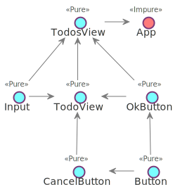

## От фреймворков к сверхфреймворкам

Note: Меня зовут Сергей. Я работаю фронтенд-разработчиком в компании QIWI. Вообще фронтенд разработкой занимаюсь примерно 5 лет. До этого примерно столько же писал на php. Меня всегда интересовало как писать безопасный и переиспользуемый код. Я расскажу о проблеммах фреймворков, которые мешают нам это делать. Цель - развить идею сверхфреймворка, который слабо связан с кодом приложения и является посредником для различных сторонних библиотек.

---

- Монолиты
- Контексты
- Переиспользуемость в экосистеме
- Оптимизация
- Ненавязчивая реактивность

---

### Монолиты

---


- Component = view + data + logic <!-- .element: class="fragment" -->
- React.setState, redux, rxjs, mobx? <!-- .element: class="fragment" -->
- Монолит <!-- .element: class="fragment" -->

Note: Сейчас большинство js-фреймворков - это обычно одно ядро, вокруг которого накручено много всего. Например, react занимается и подготовкой представления и состояние там есть, и логика вокруг него накручена.

---

### React

- Presentional (view) <!-- .element: class="fragment" -->
- Приватное состояние и логика <!-- .element: class="fragment" -->

---

### React

- <!-- .element: class="fragment" -->Container (app.state , view)
- Интеграция в приложение. Общее состояние <!-- .element: class="fragment" -->
- Reuse = 1 / время на вынесение в библиотеку  <!-- .element: class="fragment" -->

---


Note: Применительно к компонентам. Все, кто программировал на реакте, знают, что компоненты бывают pure и statefull. Поведение первых зависит только от свойств, вторые от свойств и еще от контекста, под контекстом подразумевается и состояние и React.context, разница между ними только в реактивности.

---



---


Note: Представим, что состояние есть только в корневом компоненте страницы, а все остальное - из чистых компонент, вот свойство userId в TodoEditView стало не нужным, в результате нам надо удалить его из всей цепочки. т.к. оно просто транзитом прокидывается вниз от AppView. Из-за сложности рефакторинга O(depth * props), в реальном приложении не бывает только чистых компонент, это и отличает фронтенд от бэкенда, иначе это был бы просто шаблонизатор.


---


- f(props) <!-- .element: class="fragment" -->
- f(context)(props) <!-- .element: class="fragment" -->
- new F(context).method(props) <!-- .element: class="fragment" -->

Note: Базовый кирпич - это функция. Не важно о чем речь, шаблон или код. Сами функции бывают как чистые, так и с некоторым контекстом. Классы - это набор функций с контекстом в виде this.

---

### Чистый компонент

```js
function CounterView(props: {count: number}) {
  return <div>  Count: {props.count} </div>
}
```

- JSX + flow = контракт к шаблонам <!-- .element: class="fragment" -->

Note: Чистый компонент, он же dumb, presentational - функция от свойств (иными словами шаблон, template). Основное преимущество в том, что все  или большинство ручек управления публичны, мы можем менять его поведение как угодно через них - т.е. компонент легко переиспользовать. Есть обротная сторона - сложно рефакторить приложение, по-большей части состоящее из таких компонент.


---

```js
function CounterView({count}) {
  return React.createElement('div', null, 'Count: ', count)
}
```

- чистый компонент, но vendor lock-in <!-- .element: class="fragment" -->
- Как ослабить связь? <!-- .element: class="fragment" -->

Note: Но если собрать с babel-preset-react то появится прямая зависимость от React. Нельзя переиспользовать чистый компонент в другом фреймворке, поддерживающим JSX. Однако, можно продолжить мысль и переиспользовать в рамках языка и среды, т.е. уменьшить долю каркаса, постоянной части до минимально возможной.

---

### vue-jsx

<pre class="fragment"><code class="javascript"
>Vue.component('jsx-example', {
  render (h) { // <-- h must be in scope
    return <div id="foo">bar</div>
  }
})
</code></pre>

h auto-injection <!-- .element: class="fragment" -->

<pre class="fragment"><code class="javascript"
>Vue.component('jsx-example', {
  render () {
    // const h = this.$createElement
    return <div id="foo">bar</div>
  }
})</code></pre>

---

### Нуль-компонент

<pre class="fragment"><code class="javascript"
>function CounterView({count}, h: CreateElement) {
  return h('div', null, 'Count: ', count)
}
</code></pre>

h auto-injection <!-- .element: class="fragment" -->

<pre class="fragment"><code class="javascript"
>
function CounterView({count} /* ,h */) {
  return <div>Count: count</div>
}
</code></pre>

Note: Для этого надо ослабить связь с createElement, например, добавив в конец аргумент, реализующий интефейс createElement. Такой компонент можно где угодно переиспользовать, задав соотвествующий h. Конечно усложняется написание компонента, надо добавлять аргумент, но это легко автоматизируется через babel плагин.

---

### React с состоянием

```js
class CounterView
  extends React.Component<void, {name: string}, {count: number}> {

  state = {count: 1}

  constructor(props: Props) { super(props) }

  add() {
    this.setState({ count: this.count++ })
  }

  render() { /* ... */ }
```

- React.Component <!-- .element: class="fragment" -->
- Конструктор занят под props <!-- .element: class="fragment" -->
- setState <!-- .element: class="fragment" -->

Note: React.Component - прямая завязка на реакт. Конструктор подчиняется неким негласным соглашением, что первый аргумент только props. Компонент привязан к setState и всему что вокруг него. Как же пытаются отделять состояние?

---

<pre class="fragment"><code class="javascript"
>import Component from 'my-react-like'
</code></pre>
&nbsp;
<pre class="fragment"><code class="javascript"
>class CounterView
  extends Component<{name: string}, {count: number}> {

  some: Some

  constructor(some: Some) { super(); this.some = some }

  render() { /* ... */ }
}
// ...
</code></pre>
&nbsp;
<pre class="fragment"><code class="javascript"
>&lt;CounterView name={123} /&gt; // 0 errors
</code></pre>

Типы и JSX в Vue, Deku? <!-- .element: class="fragment" -->

---

### Vue component

```js
<template> <p>Hello, {{message}}</p> </template>

<script>
export default {
  name: 'hello',
  data: {
    message: 'Hello Vue.js!'
  },
  mixins: [myMixin],
  methods: {
    reverseMessage: function () {
      this.message = this.message.split('').reverse().join('')
    }
  }
}
</script>
```

- К React.createClass, опять? <!-- .element: class="fragment" -->
- fuck the flow <!-- .element: class="fragment" -->

---

### vuex - vue only


Note: В продолжении темы монолитов следует сказать про копипаст. Я уже говорил про универсальный каркас, куда интегрируются сторонние либы. Так вот на фронтенде его нет, каждый переизобретает этот каркас в своем ядре. Причем мыслят старыми категориями безтипового js, без DI. Поэтому vuex работает только с vue.

---


# Контексты

---

### Vue


---

### Parent

```js
// ParentComponent.vue
<template>
  <child-component></child-component>
</template>

<script>
import ChildComponent from './ChildComponent'

const MyDependency = {
  foo: 'bar'
}

export default {
  name: 'parent',
  provide: {
    MyDependency
  }
}
</script>
```

---

### Child

```js
// ChildComponent.vue
<template>
  <p>{{ MyDependency.foo }}</p>
</template>

<script>
  export default {
    name: 'child',
    inject: [ 'MyDependency' ]
  }
</script>
```

- Не модульно <!-- .element: class="fragment" -->
- Инжекция на строках <!-- .element: class="fragment" -->

---

### React


---

### React + redux

<pre><code class="javascript"
>function CounterView(props: {count: number, add: () => void}) {
  return <div>
    {props.count}: <button onClick={add}>Add</button>
  </div>
}
</code></pre>
&nbsp;
<pre class="fragment"><code class="javascript"
>function mapStateToProps(store) {
  return { count: store.counter.count }
}
const CounterContainer = connect(mapStateToProps)(CounterView)
</code></pre>
&nbsp;

<pre class="fragment"><code class="javascript"
>&lt;Provider store={'XYZ'}&gt; // unsafe
  &lt;CounterContainer/&gt;
&lt;/Provider&gt;
</code></pre>

Note: Например, как в redux. Оборачивают чистый компонент в connect, а в точке входа провайдят store, через Provider. Почему в свойство стор = XYZ в последнем блоке? Потому что flow и ts не могут обнаружить несоотвествие типов с тем, что в mapStateToProps. Как работает Provider внутри?

---

<pre class="fragment"><code class="javascript"
>class App extends React.Component {
  static childContextTypes = {
    store: PropTypes.object
  }

  getChildContext() {
    return { store: this.props.store }
  }

  render = () => &lt;CounterContainer/&gt;
}
</code></pre>
&nbsp;
<pre class="fragment"><code class="javascript"
>class CounterContainer extends React.Component {
  static contextTypes = {
    store: PropTypes.object
  }

  render = () => CounterView({ count: this.context.store.count })
}
</code></pre>

Note: Есть механизм React.context. В App мы регистрируем зависимости через getChildContext и childContextTypes. В CounterContainer мы вытаскиваем данные из контекста. Механизм этот страшный, фейсбуковцы сами его стыдятся, поэтому не сильно документируют. PropTypes - это эмуляция типизации, лохматое легаси со времен отсутствия flow. Такое решение не может нормально интегрироваться в ts или flow.

---

### Angular


Note: Вообще, ui-фреймворков очень много, я не буду всех их упоминать. Сказать стоит пожалуй только про angular2, т.к. несмотря на свои недостатки, он среди всего этого зоопарка чуть приподнялся на ступеньку.

---

```js
@Component({
  selector: 'my-counter',
  templateUrl: './counter.component.html'
})
class CounterView {
  counter: number = 0
  @Input name: string

  constructor(private counterService: CounterService) {}

  addCounter() {
    this.counter = this.counterService.add(this.counter)
  }
}
```

PropTypes на constructor

Note: Angular2: Один к одному сцепили шаблон, описание контракта к этому шаблону, модель, и логику по работе с ней. На ней слишком много отвественности. Нельзя прикрутить mobx, вместо, а не поверх changeDetection. Нельзя заменить changeDetection на свой, что может потребоваться как ради экспериментов, так и ради оптимизаций. Ребята из команды angular2 идею контекста сделали центральной. В итоге это гораздо ближе к нативному синтаксису typescript.

---

<pre><code class="typescript"
>const Injectable = 0 as any

interface ITest {}
class CounterService {}

@Injectable()
class CounterView {
  constructor(private cs: CounterService, test: ITest) {}
}
</code></pre>

tsc --emitDecoratorMetadata test.ts <!-- .element: class="fragment" -->

<pre class="fragment"><code class="typescript"
>Reflect.metadata(CounterView, "design:paramtypes", [
  CounterService,
  Object
])
</code></pre>

ITest -> Object, WAT? <!-- .element: class="fragment" -->

<!-- .element: class="fragment" --> ``` map[ITest] = SomeClass ```

Note: Что бы магия заработала, ангуларовцы, слегка прогнув микрософт с их тайпскриптом, записывают сигнатуру конструктора в метаданные. Dependency injection ангулара, вместо CounterService подсовывает готовый объект. Это называется рефлексия, во многих языках она из коробки, в ts прибитая к декораторам и не работающая с интерфейсами. Например, итерфейсы просто заменяются на Object. map[ITest] = SomeClass можно делать в C# и Dart, однако в дартовом ангуларе не используется эта фича, в отличие от C# Ninject. Именно из-за слабого развития инструментов и типизации, позволяющих делать reflection, DI был так непопулярен у нас на фронтенде. Поэтому аналогично с типами в JSX-шаблонах у ангулар2 нет здесь конкурентов.

---

### Angular2 templates

```js
@Component({
  selector: 'app',
  template: `{{cnt}} <button (click)="add2()">Add</button>`
})
export class CounterView {
  counter: number = 0
  add(){
    this.counter += 1
  }
}
```

- ДЕКОРАТОРЫ <!-- .element: class="fragment" -->
- typescript проигнорирует типы в шаблоне <!-- .element: class="fragment" -->

---


---


Vendor lock-in everywhere

Note: Механизма обмена решениями между фреймворками нет. Выбрав один путь - придется и выбрать экосистему вокруг фреймворка. Конкрурировать в этой гонке могут только те, у кого больше ресурсов для хайпа.

---

## Оптимизация

---

#### Оптимизация фреймворков = хайп


- Хайп 5 > 3 <!-- .element: class="fragment" -->
- <!-- .element: class="fragment" --> ~~Связанность, сцепленность~~
- react fiber, vdom, prepack, inferno <!-- .element: class="fragment" -->
- Не имеет отношения к решению <!-- .element: class="fragment" -->


Note: Про оптимизацию слишком много хайпа, в основном, все современные тенденции во фронтенде это про то, кто больше попугаев покажет в ui-bench: fiber, vdom, prepack, inferno. Оптимизация нужна из-за отставания браузеров от бизнес задач и медленной скорости их развития из-за легаси из которого состоит web. Так проще конкурировать, цифрами убедить проще, т.к. меньше надо знать. React 3 попугая выдает, Inferno 5, значит Inferno лучше. Конкурировать, доказывая архитектурные преимущества, гораздо сложнее. Т.к. проявляются эти преимущества не сразу и на достаточно больших задачах, увидеть их можно только в сравнении, пройдя опыт и говнокодной разработки.

---

#### Оптимизации в приложении = костыли

```js
class CounterView extends React.Component {
  state = {count: 0}

  shouldComponentUpdate(nextProps, nextState) {
    return nextState.count === this.state.count
  }

  _add = () => this.setState({ count: this.state.count++ })

  render() {
    return <div>{this.props.name}: {this.state.count}
      <button onClick={this._add}>Add</button>
    </div>
  }
}
```

Note: Оптимизация в приложении - это доп. код, который может содержать логические ошибки и анализаторы не помогут их отловить. А вы нашли тут багу, не? Вот flow не нашел.

---

### Angular

```js
@Component({
  selector: 'app',
  changeDetection: ChangeDetectionStrategy.OnPush,
  template: `{{counter}} <button (click)="add()">Add</button>`
})
export class CounterView {
  public counter : number = 0;
  constructor(private cd: ChangeDetectorRef) {}

  add() {
    this.counter += 1
    this.cd.markForCheck()
  }
}
```

- Event -> viewRef.detectChanges <!-- .element: class="fragment" -->
- Minesweeper <!-- .element: class="fragment" -->
- OnPush = shouldComponentUpdate <!-- .element: class="fragment" -->

Note: Думаете в angular2 лучше? Там на любое событие дерагется detectChanges. Это видимо тормозной на больших приложениях механизм, который правильнее было бы не делать в ангуларе вовсе, а вынести в стороннее решение. Тут changeDetection.OnPush такой же костыль как и shouldComponentUpdate.

---


Note: Это я к тому, что оптимизация в коде приложения не нормальное явление, как нам пытаются преподнести из многочисленных маркетинговых докладов. Это признание несостоятельности идеи или реализации фреймворка касательно автоматической оптимизации. Кто-нибудь помнит, как нам несколько лет назад был хайп о том, что VDOM в реакте вообще позволит не парится об оптимизации, все сделает за вас.

---

### Vue

- Observable state + vdom <!-- .element: class="fragment" -->
- No shouldComponentUpdate <!-- .element: class="fragment" -->

---

### Mobx

- cellx, derivablejs, mol
- Обратился к свойству - подписался<!-- .element: class="fragment" -->
- Ранняя точная оптимизация без VDOM <!-- .element: class="fragment" -->

Note: В свете оптимизации стоит упомянуть mobx и идейно похожие решения - derivable, cellx, mol_atom. Это все реализации ненавязчивых стримов. Подписка компонента на изменения в данных происходит в момент обращения к свойствам. Оптимизация происходит раньше, в слое данных, а не в VDOM (react) или в компонентах (angular). В подобных решения VDOM не нужен.

---

```js
const CounterView = observer(store => <div>{store.count}</div>)

const AppView = observer(store => <div>
  <CounterView count={store}/>
</div>)

class Store {
  @observable count: number = 0
}

const store = new Store()
React.render(<AppView store={store} />, document.body)

store.count = 1 // rerender
```

Note: Компоненты подписываются непосредственно на те свойства, которые они используют в Store. Можно все компоненты сделать observer-ами, но только CounterView обращается к store.count, поэтому при изменении count, будет перерисован только он. Эта идея дает гораздо больше резервов оптимизации.

---

```js
const CounterView = /*observer*/(store => <div>{store.count}</div>)

const AppView = /*observer*/(store => <div>
  <CounterView count={store}/>
</div>)

class Store {
  /*@observable*/ count: number = 0
}

const store = new Store()
React.render(<AppView store={store} />, document.body)

store.count = 1 // rerender
```

Note: Фреймворк - это каркас, с точками расширения, куда мы ваставляем данные, логику и верстку, а что если уменьшить долю каркаса до 0? Зависимость от React и mobx перейдет в зависимость от спецификации и подхода к разработке. Это позволит быть менее зависимым от хайпа.

---

* Простота (vue, mobx)
* Не монолитность (angular)<!-- .element: class="fragment" -->
* Резервы оптимизации (mobx)<!-- .element: class="fragment" -->

---

## Ненавязчивая реактивность

---

### View

```js
class Counter { count = 0 }

function Hello(
    // public
    {text}: { text: string; },

    // private
    {counter}: { counter: Counter; }
) {
    return <div>
        <h1>{text} {counter.count}</h1>
    </div>
}
```

Note: Чистая верстка, с контрактом и разделением на публичный интрефейс (props) и приватный (context). Также, никаких декораторов и зависимостей от фреймворков.

---

```js
function Counter() { this.count = 0 }

function Hello(_ref, _ref2, _t) {
    var text = _ref.text;
    var counter = _ref2.counter;

    return _t.h(2, 'div', null, [
      _t.h(2, 'h1', null, ['count ', counter.count])
    ]);
}

Hello._isComponent = true;
Hello._dependencies = [{ counter: Counter }];
```

context = DI + metadata

Note: С помощью babel-плагина к компоненту добавляются метаданные. По метаданным движок reactive-di отличает свои компоненты от реактовых, решается проблема легаси.

---

### Lifecycle

```js
class Counter { count = 0 }

@hooks(Counter)
class CounterHooks {

  constructor(private fetcher: Fetcher) {}

  pull(counter: Counter): Observable<Counter> {
    return this.fetcher.fetch('/api/some')
  }
}
```

- Mobx / where <!-- .element: class="fragment" -->
- Cellx / pull <!-- .element: class="fragment" -->

Note: Часто бывает так, компонент отрендерился и вам нужно актуализировать его состояние. Тут помогают механизмы, которые есть в некоторых ORM на других языках (Doctrine, Hibernate). Логика актуализации состояния Counter задается в таком сервисе. Когда первый раз отрендерится хотя бы один компонент, использующий Counter, выполнится метод pull и Observable c этого момента будет управлять Counter ом. В mobx аналогично сделан хелпер where, в cellx и mol есть похожие механизмы.

---

- 15й стандарт
- Совместим с 14м (React) <!-- .element: class="fragment" -->
- Поддерживается в flow <!-- .element: class="fragment" -->
- Работает legacy <!-- .element: class="fragment" -->
- Interoperability <!-- .element: class="fragment" -->
- Ъ-Чистые <!-- .element: class="fragment" -->
-  <!-- .element: class="fragment" --> ~~Smart, dumb~~

---

### !!!

- Экосистема вокруг типов (jsx, angular) <!-- .element: class="fragment" -->
- Слои: data - ui - business logic (angular) <!-- .element: class="fragment" -->
- Ненавязчивость (mobx)<!-- .element: class="fragment" -->
- KISS (vue) <!-- .element: class="fragment" -->
- КПД: 3-4 (angular -  15K, inferno - 5K)<!-- .element: class="fragment" -->

---


- [smart.dumb](https://medium.com/@dan_abramov/smart-and-dumb-components-7ca2f9a7c7d0#.xlt8kcxk8)
- [react-context](https://facebook.github.io/react/docs/context.html)
- [angular2.di](https://angular.io/guide/hierarchical-dependency-injection)
- [inversify.di](https://github.com/inversify/InversifyJS/blob/master/wiki/hierarchical_di.md)
- [vue.di](https://blog.kloud.com.au/2017/03/22/dependency-injection-in-vuejs-app-with-typescript/)
- [ninject](http://www.ninject.org/)
- [reactive.di](https://github.com/zerkalica/reactive-di)

Note: Через тернии к звездам. Идеального решения пока нет. Надеюсь я смог показать, что в нашей любимой фронденд архитектуре есть проблемы, которые не заметны с близкого расстояния, но видны на большом. Идеи ненавязчивых потоков и инверсии зависимостей заслуживают больше внимания. Хотелось бы больше альтернатив mobx и angular2. Я, вышеозвученные характеристики реализовываю в reactive-di. А всем желаю уделять больше внимания базовым, идейным вещам, а меньше маркетинговым - хайповым, тогда наша работа станет комфортнее.

---


- [git.io/vQL3X](https://git.io/vQL3X)
- [nexor@ya.ru](mailto:nexor@ya.ru)

<div style="padding-top: 2em;text-align: left;font-size: 80%;">Юферев Сергей, qiwi.ru</div>
